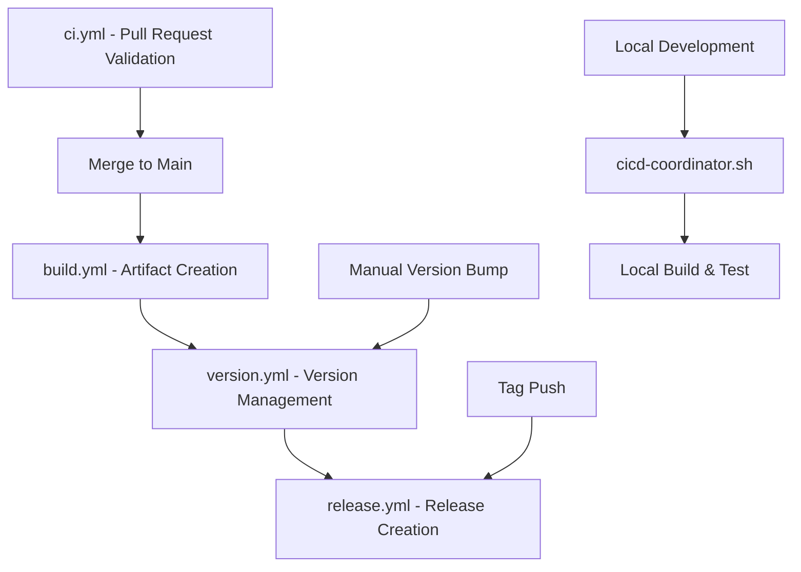

# GitHub Actions Workflows

This document describes the unified CI/CD system for Personal Pipeline MCP Server.

## 🚀 Unified CI/CD System

The project uses a comprehensive CI/CD system with four main workflows:

### 1. Continuous Integration (`ci.yml`)
**Trigger:** Pull requests to main branch  
**Purpose:** Validate code quality and ensure changes are ready for merge

**What it does:**
- Code quality checks (linting, formatting, type checking)
- Security scanning (npm audit, Trivy, CodeQL)
- Test execution (unit and integration tests)
- Package and Docker build validation
- Performance benchmarks
- Quality gate summary with PR comments

**Quality Gates:**
- ✅ All code must pass linting and formatting
- ✅ TypeScript compilation must succeed
- ✅ All tests must pass with >80% coverage
- ✅ Security scans must pass (no critical vulnerabilities)
- ✅ Build artifacts must be valid

### 2. Build & Package (`build.yml`)
**Trigger:** Pushes to main branch  
**Purpose:** Build production-ready artifacts for both npm and Docker

**What it does:**
- Coordinates npm package and Docker image builds
- Multi-architecture Docker builds (amd64, arm64)
- Artifact validation and testing
- Security scanning of built artifacts
- Prepares artifacts for release (not published)

**Outputs:**
- npm package ready for registry publishing
- Multi-architecture Docker images in GHCR
- Build reports and metadata
- Size analysis and performance metrics

### 3. Release Management (`release.yml`)
**Trigger:** Version tags (v*) or manual dispatch  
**Purpose:** Create releases with comprehensive artifact preparation

**What it does:**
- Version management and changelog generation
- Build coordination (calls build.yml)
- Security validation of release artifacts
- GitHub release creation with assets
- Optional publishing to registries (controlled by inputs)

**Release Artifacts:**
- npm package tarball
- Docker images with version tags
- Release notes and changelog
- Security scan reports

### 4. Version Management (`version.yml`)
**Trigger:** Manual dispatch or scheduled analysis  
**Purpose:** Automated semantic versioning with conventional commits

**What it does:**
- Analyzes conventional commits for version requirements
- Suggests appropriate version bumps (patch/minor/major)
- Updates all version references consistently
- Creates git commits and tags
- Validates version impact and compatibility

**Version Strategies:**
- **Auto:** Analyzes commits using conventional commit format
- **Manual:** Explicit version bump specification
- **Custom:** Direct version specification
- **Dry Run:** Preview changes without applying

## 🔧 Local Development Integration

### CI/CD Coordinator Script
Use the unified CI/CD coordinator for local development:

```bash
# Show CI/CD status
npm run cicd:status

# Validate CI/CD configuration
npm run cicd:validate

# Build all artifacts locally
npm run cicd:build

# Manage versions
npm run cicd:version:patch
npm run cicd:version:minor
npm run cicd:version:major

# Setup CI/CD environment
npm run cicd:setup

# Cleanup artifacts
npm run cicd:cleanup
```

### Development Workflow
1. **Feature Development:** Work on feature branches
2. **Pull Request:** CI workflow validates changes
3. **Merge to Main:** Build workflow creates artifacts
4. **Version Management:** Use version workflow to bump versions
5. **Release:** Use release workflow to create and publish releases

## 📋 Workflow Dependencies



## 🛡️ Security & Quality

### Security Scanning
- **npm audit:** Dependency vulnerability scanning
- **Trivy:** Container and filesystem security scanning
- **CodeQL:** Source code security analysis
- **SARIF uploads:** Security results integrated with GitHub Security tab

### Quality Gates
- **Code Quality:** ESLint, Prettier, TypeScript compilation
- **Test Coverage:** >80% unit test coverage required
- **Performance:** Sub-200ms response time validation
- **Build Validation:** Package and container functionality testing

### Artifact Security
- All release artifacts are security scanned
- Critical vulnerabilities block releases
- Regular security audits on dependencies
- Signed commits and tags for releases

## 🔄 Branching Strategy

### Main Branch Protection
- Requires pull request reviews
- Requires status checks to pass
- No direct pushes allowed
- Linear history enforced

### Feature Branches
- Create from main branch
- Use conventional commit format
- Automated CI validation on PR
- Merge after approval and CI success

### Release Process
- Version tags trigger release workflow
- Automated changelog generation
- Artifact creation and validation
- Optional registry publishing

## 📊 Monitoring & Metrics

### Build Metrics
- Build duration and success rates
- Artifact size analysis
- Test coverage trends
- Security scan results

### Performance Metrics
- Response time validation
- Container startup time
- Package size optimization
- Load test results

### Workflow Analytics
- Workflow execution frequency
- Success/failure rates
- Resource utilization
- Deployment frequency

## 🚨 Troubleshooting

### Common Issues

**CI Failures:**
1. Check code quality (linting, formatting)
2. Verify test coverage and test failures
3. Review security scan results
4. Validate build configuration

**Build Failures:**
1. Check dependency compatibility
2. Verify TypeScript compilation
3. Review Docker build logs
4. Validate artifact structure

**Release Issues:**
1. Verify version tag format (v1.2.3)
2. Check security scan results
3. Review artifact validation
4. Validate registry credentials

### Debugging Commands

```bash
# Validate CI/CD configuration
npm run cicd:validate

# Check workflow status
gh run list --limit 10

# Download workflow artifacts
gh run download <run-id>

# View workflow logs
gh run view <run-id> --log

# Check local build
npm run cicd:build --verbose
```

## 📚 Additional Resources

- [GitHub Actions Documentation](https://docs.github.com/en/actions)
- [Conventional Commits](https://conventionalcommits.org/)
- [Semantic Versioning](https://semver.org/)
- [Docker Multi-Architecture Builds](https://docs.docker.com/buildx/working-with-buildx/)
- [npm Publishing Guide](https://docs.npmjs.com/packages-and-modules/contributing-packages-to-the-registry)

## 🔐 Required Secrets

Configure these secrets in GitHub repository settings:

| Secret | Purpose | Required For |
|--------|---------|--------------|
| `GITHUB_TOKEN` | GitHub API access | Automated (provided by GitHub) |
| `NPM_TOKEN` | npm registry publishing | Release workflow |
| `DOCKERHUB_USERNAME` | Docker Hub access | Docker publishing |
| `DOCKERHUB_TOKEN` | Docker Hub token | Docker publishing |

## 🎯 CI/CD Best Practices

1. **Fail Fast:** Catch issues early in the CI pipeline
2. **Parallel Execution:** Run independent jobs in parallel
3. **Artifact Caching:** Use intelligent caching for dependencies
4. **Security First:** Security scanning in every workflow
5. **Observability:** Comprehensive logging and metrics
6. **Rollback Ready:** Always prepare for rollback scenarios
7. **Environment Parity:** Keep dev/staging/prod environments consistent

---

*This CI/CD system is designed for reliability, security, and developer productivity. For questions or improvements, please open an issue or submit a pull request.*