# Architecture Documentation

This document provides a comprehensive overview of Personal Pipeline's system architecture, components, and design decisions.

## System Overview

Personal Pipeline is an intelligent Model Context Protocol (MCP) server designed for automated retrieval of internal documentation to support AI-driven monitoring alert response and incident management.

### High-Level Architecture

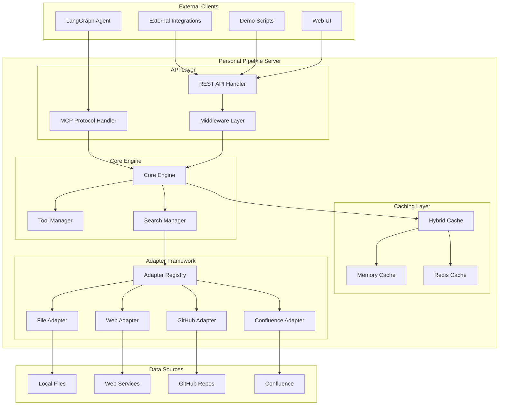

## Core Components

### 1. API Layer

The API layer provides dual access patterns to accommodate different integration needs:

#### MCP Protocol Handler
- **Purpose**: Native MCP protocol support for LangGraph agents
- **Implementation**: `src/core/server.ts`
- **Features**:
  - 7 core MCP tools
  - Real-time tool execution
  - Structured response formats
  - Error handling and logging

#### REST API Handler
- **Purpose**: HTTP endpoint access for web integrations
- **Implementation**: `src/api/routes.ts`
- **Features**:
  - 11 REST endpoints
  - OpenAPI/Swagger documentation
  - Request validation and transformation
  - Performance monitoring

#### Middleware Layer
- **Purpose**: Cross-cutting concerns for API requests
- **Implementation**: `src/api/middleware.ts`
- **Components**:
  - Request validation
  - Performance monitoring
  - Error handling
  - Security headers
  - CORS support

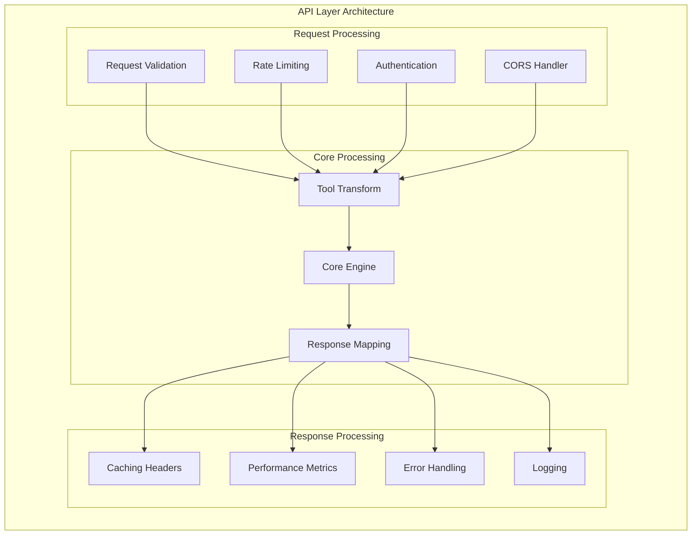

### 2. Core Engine

The core engine coordinates tool execution, search operations, and response generation.

#### Core Server (PersonalPipelineServer)
- **Location**: `src/core/server.ts`
- **Responsibilities**:
  - MCP tool registration and execution
  - Request routing and coordination
  - Error handling and recovery
  - Performance monitoring

#### Tool Manager (PPMCPTools)
- **Location**: `src/tools/index.ts`
- **Features**:
  - 7 core MCP tools implementation
  - Tool validation and execution
  - Response formatting and confidence scoring
  - Caching integration

```typescript
class PPMCPTools {
  // Primary operational tools
  search_runbooks(alertType, severity?, systems?, context?)
  get_decision_tree(scenario, context?)
  get_procedure(procedureId, step?)
  get_escalation_path(severity, context?, businessHours?)
  
  // Supporting tools
  list_sources(includeHealth?)
  search_knowledge_base(query, filters?)
  record_resolution_feedback(incidentId, outcome, feedback?)
}
```

### 3. Search and Intelligence Layer

#### Intelligent Search Engine
- **Location**: `src/search/intelligent-search-engine.ts`
- **Features**:
  - Multi-adapter search coordination
  - Confidence scoring algorithms
  - Result ranking and filtering
  - Performance optimization

#### Query Processing Pipeline
- **Location**: `src/search/query-processing/`
- **Components**:
  - Intent classification
  - Context enhancement
  - Query optimization
  - Operational intelligence

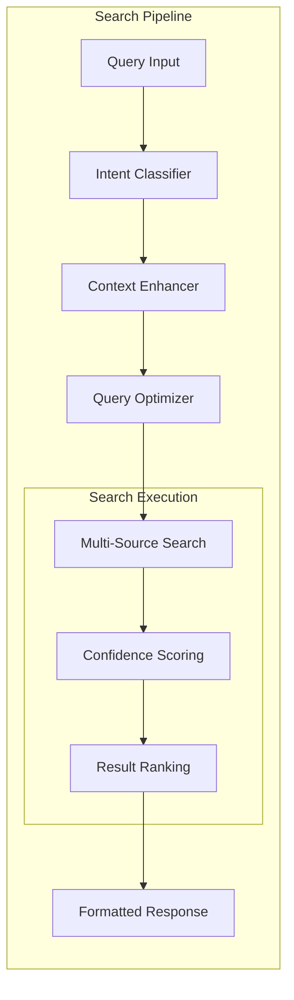

### 4. Caching System

#### Hybrid Caching Architecture
- **Implementation**: `src/utils/cache.ts`
- **Strategy**: Multi-tier caching with intelligent fallback
- **Performance**: <50ms cache hits, graceful degradation

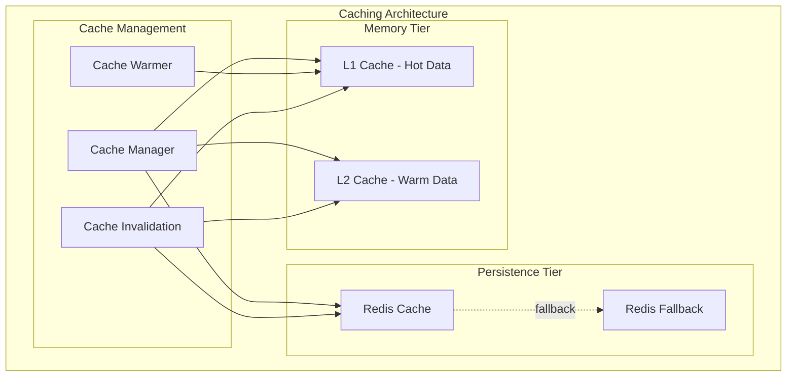

#### Cache Strategies
1. **Hot Path Caching**: Critical runbooks cached in memory
2. **Warm Cache**: Frequently accessed content in Redis
3. **Cold Storage**: Full search index with lazy loading
4. **Cache Warming**: Proactive loading of high-priority content

### 5. Adapter Framework

#### Base Architecture
```typescript
abstract class SourceAdapter {
  abstract search(query: string, filters?: any): Promise<SearchResult[]>
  abstract getDocument(id: string): Promise<Document>
  abstract searchRunbooks(alertType: string, severity?: string, systems?: string[]): Promise<RunbookResult[]>
  abstract healthCheck(): Promise<HealthStatus>
  abstract getMetadata(): Promise<AdapterMetadata>
  abstract cleanup(): Promise<void>
}
```

#### File System Adapter
- **Location**: `src/adapters/file-enhanced.ts`
- **Features**:
  - Recursive directory scanning
  - Multiple format support (MD, JSON, YAML, TXT)
  - Intelligent content indexing
  - Real-time file watching
  - Metadata extraction

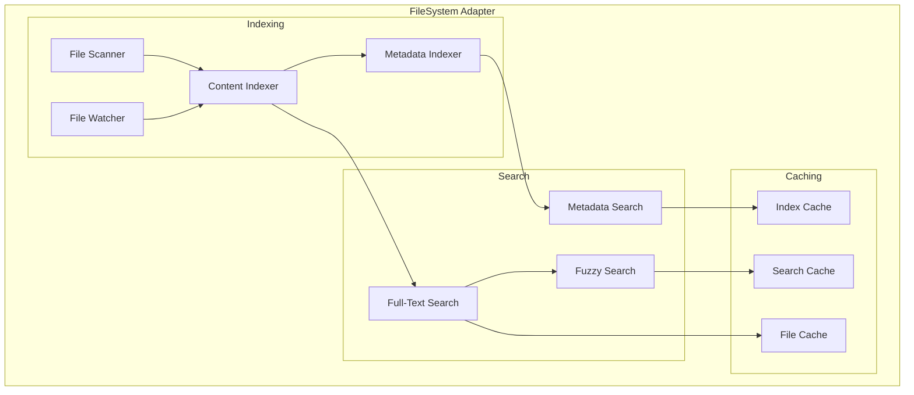

#### Web Adapter
- **Location**: `src/adapters/web/`
- **Components**:
  - HTTP client with retry logic
  - Content extraction and cleaning
  - Authentication management
  - Rate limiting and circuit breaker
  - URL management and validation

### 6. Configuration System

#### Configuration Manager
- **Location**: `src/utils/config.ts`
- **Features**:
  - YAML configuration parsing
  - Environment variable support
  - Runtime configuration validation
  - Hot configuration reloading

```yaml
# Configuration Structure
server:
  port: 3000
  host: '0.0.0.0'
  
cache:
  strategy: hybrid  # memory | redis | hybrid
  ttl: 300
  
sources:
  - name: "local-runbooks"
    type: "file"
    config: { /* adapter-specific config */ }
    
performance:
  concurrent_searches: 10
  timeout_ms: 5000
```

## Data Flow

### MCP Tool Execution Flow

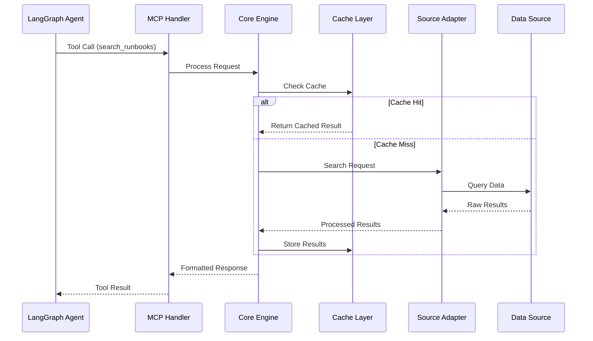

### REST API Request Flow

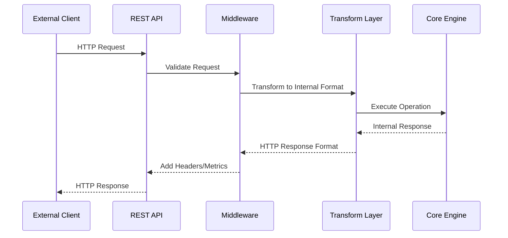

## Performance Architecture

### Response Time Optimization

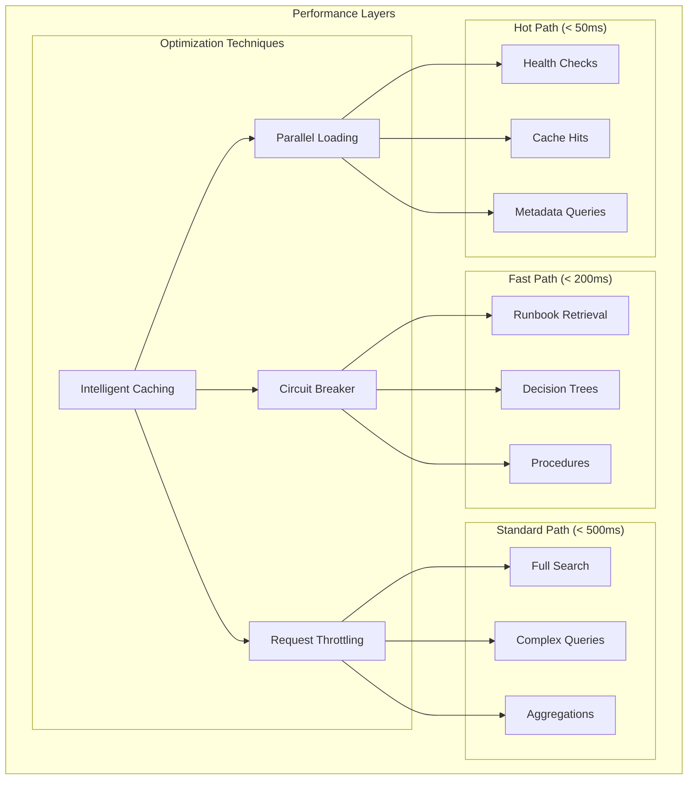

### Scalability Patterns

1. **Horizontal Scaling**: Multiple server instances with shared cache
2. **Vertical Scaling**: Resource optimization and memory management
3. **Cache Scaling**: Distributed caching with consistent hashing
4. **Adapter Scaling**: Independent scaling of adapter instances

## Security Architecture

### Security Layers

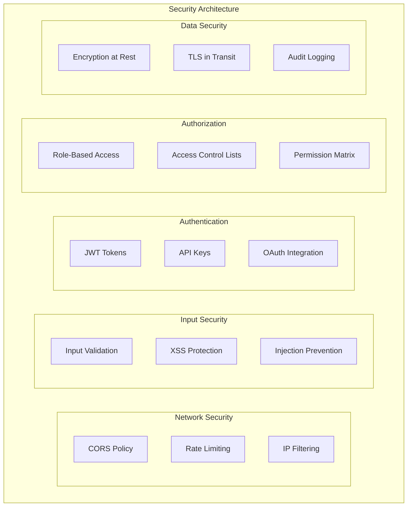

### Security Features

1. **Input Sanitization**: All inputs validated and sanitized
2. **HTTPS Enforcement**: TLS encryption for all communications
3. **Rate Limiting**: Protection against abuse and DDoS
4. **Audit Logging**: Comprehensive security event logging
5. **Secret Management**: Environment variable based credential storage

## Monitoring and Observability

### Monitoring Stack

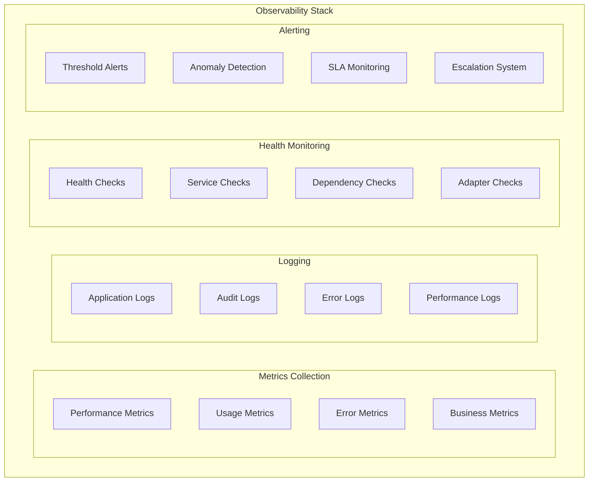

### Key Metrics

1. **Performance Metrics**:
   - Response times (P50, P95, P99)
   - Request throughput
   - Cache hit rates
   - Error rates

2. **Business Metrics**:
   - Runbook retrieval success rate
   - Average resolution time improvement
   - User satisfaction scores
   - Knowledge base coverage

3. **System Metrics**:
   - CPU and memory usage
   - Network I/O
   - Disk usage
   - Connection pool status

## Deployment Architecture

### Containerized Deployment

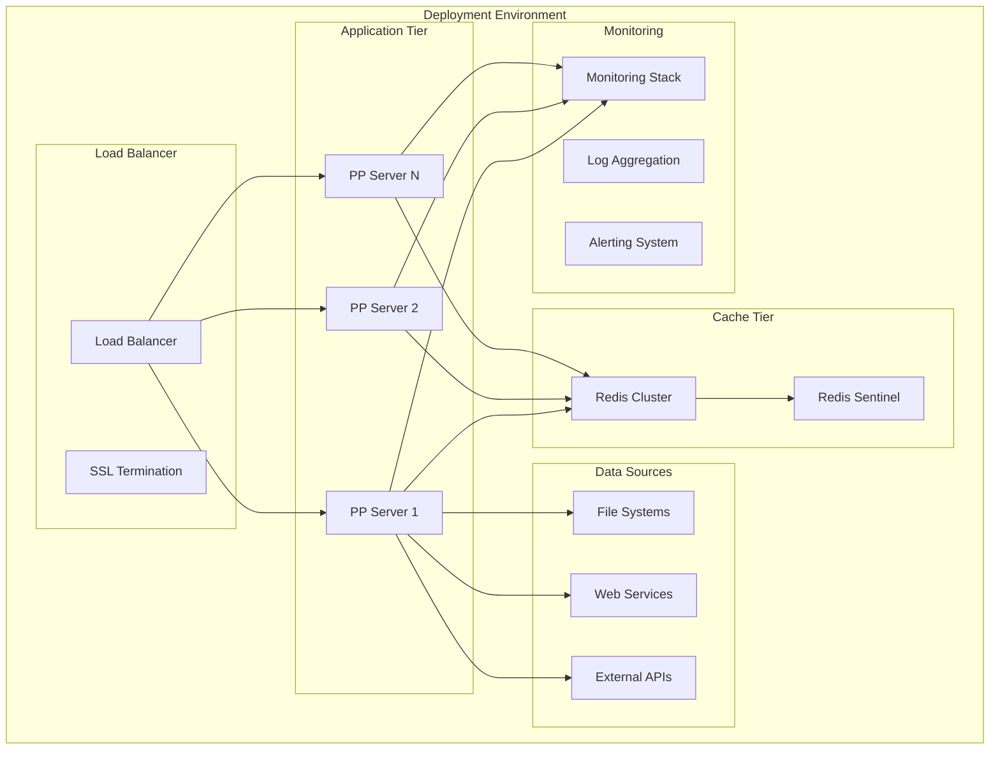

### Docker Configuration

```dockerfile
# Multi-stage build for optimization
FROM node:20-alpine AS builder
WORKDIR /app
COPY package*.json ./
RUN npm ci --only=production

FROM node:20-alpine AS runtime
WORKDIR /app
COPY --from=builder /app/node_modules ./node_modules
COPY . .
RUN npm run build

EXPOSE 3000
HEALTHCHECK --interval=30s --timeout=3s --start-period=5s --retries=3 \
  CMD curl -f http://localhost:3000/api/health || exit 1

CMD ["npm", "start"]
```

## Development Architecture

### Development Environment

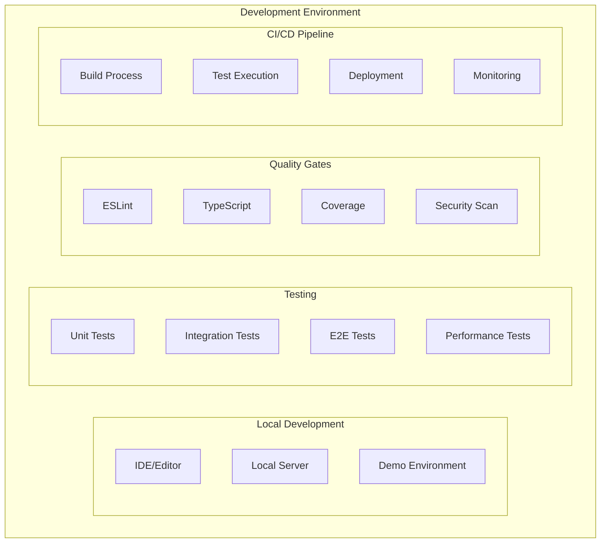

### Development Workflow

1. **Local Development**: Hot reload with TypeScript compilation
2. **Testing**: Comprehensive test suite with coverage reporting
3. **Quality Assurance**: Automated linting, type checking, and security scanning
4. **CI/CD**: Automated build, test, and deployment pipeline
5. **Monitoring**: Continuous performance and error monitoring

## Future Architecture Considerations

### Planned Enhancements

1. **Semantic Search**: Integration of embedding-based search
2. **Machine Learning**: Predictive analytics for incident response
3. **Multi-tenancy**: Support for multiple organizations
4. **Federation**: Distributed deployment across multiple regions
5. **Event Streaming**: Real-time event processing and notifications

### Scalability Roadmap

1. **Phase 1**: Vertical scaling optimization
2. **Phase 2**: Horizontal scaling with load balancing
3. **Phase 3**: Microservices decomposition
4. **Phase 4**: Event-driven architecture
5. **Phase 5**: Global distribution and edge computing