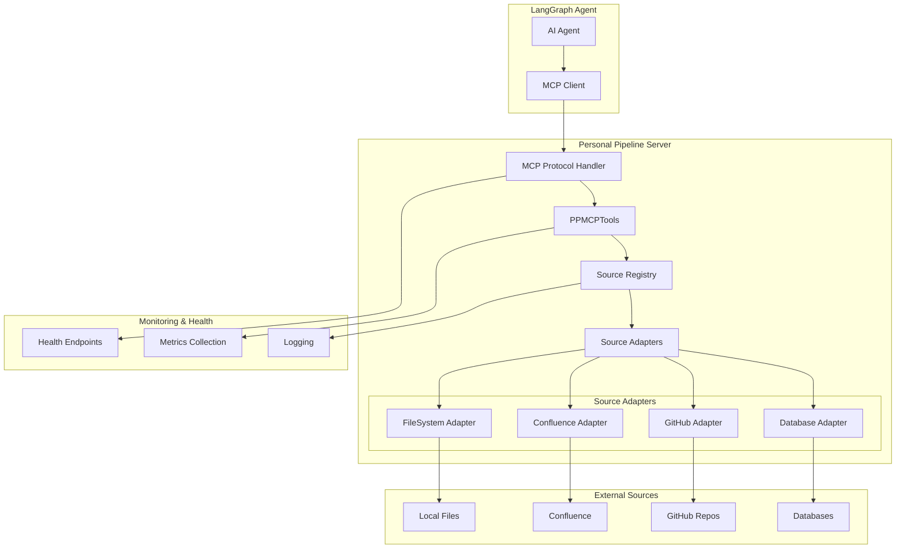
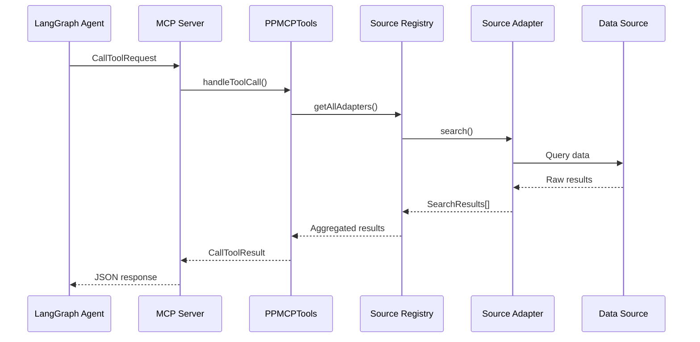
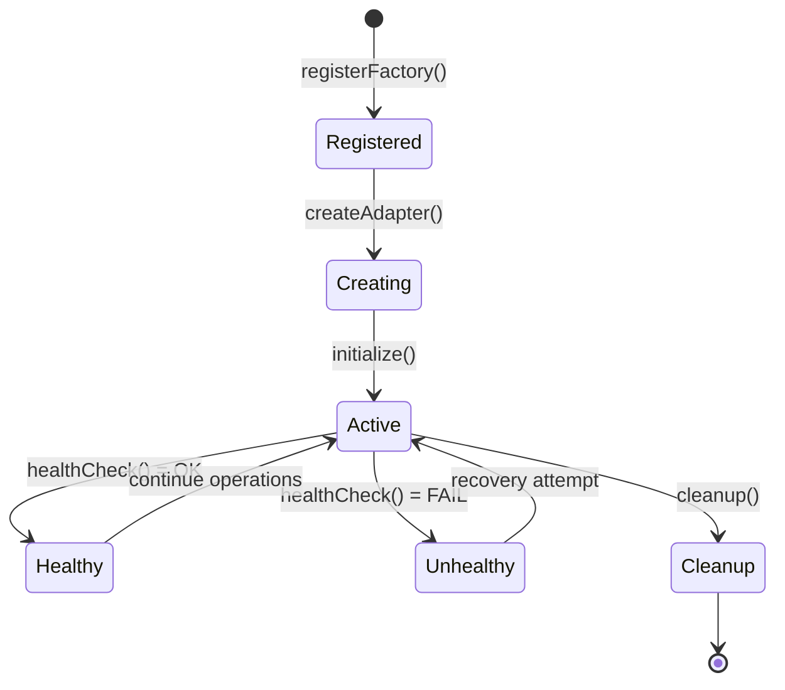
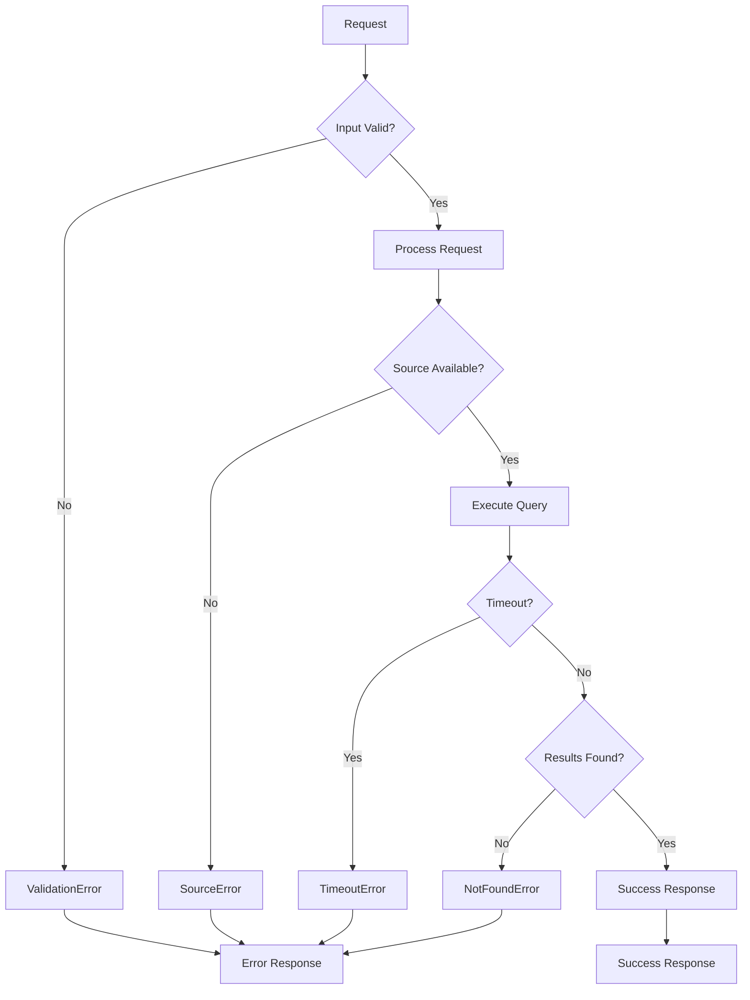

# Personal Pipeline Architecture Documentation

## System Overview

The Personal Pipeline MCP server implements a modular, event-driven architecture designed for high-performance document retrieval and incident response support. The system follows the Model Context Protocol (MCP) specification and provides intelligent documentation retrieval capabilities.

## High-Level Architecture



## Core Components

### 1. MCP Protocol Layer

**Location**: `src/core/server.ts`

The `PersonalPipelineServer` class implements the MCP specification:

- **Transport**: stdio-based communication with LangGraph agents
- **Protocol Handlers**: `ListToolsRequest` and `CallToolRequest` handlers
- **Error Management**: Structured error responses with proper formatting
- **Connection Management**: Graceful startup and shutdown procedures

```typescript
// MCP server setup with stdio transport
const server = new Server({
  name: 'personal-pipeline-mcp',
  version: '0.1.0'
}, {
  capabilities: { tools: {} }
});

// Tool request handling
server.setRequestHandler(CallToolRequestSchema, async (request) => {
  return await mcpTools.handleToolCall(request);
});
```

### 2. Tool Implementation Layer

**Location**: `src/tools/index.ts`

The `PPMCPTools` class provides 7 core MCP tools:

#### Tool Categories:
- **Primary Tools**: `search_runbooks`, `get_decision_tree`, `get_procedure`, `get_escalation_path`
- **Support Tools**: `list_sources`, `search_knowledge_base`, `record_resolution_feedback`

#### Tool Architecture:
```typescript
class PPMCPTools {
  async handleToolCall(request: CallToolRequest): Promise<CallToolResult> {
    // 1. Input validation and logging
    // 2. Tool dispatch based on request.params.name
    // 3. Error handling and response formatting
    // 4. Performance monitoring and metrics
  }
}
```

### 3. Source Adapter Framework

**Location**: `src/adapters/base.ts`, `src/adapters/file.ts`

#### Abstract Base Class Pattern:
```typescript
abstract class SourceAdapter {
  // Core search functionality
  abstract search(query: string, filters?: SearchFilters): Promise<SearchResult[]>;
  abstract getDocument(id: string): Promise<SearchResult | null>;
  
  // Specialized runbook search
  abstract searchRunbooks(
    alertType: string, 
    severity: AlertSeverity, 
    affectedSystems: string[]
  ): Promise<Runbook[]>;
  
  // Health and lifecycle management  
  abstract healthCheck(): Promise<HealthCheck>;
  abstract getMetadata(): Promise<any>;
  abstract cleanup(): Promise<void>;
}
```

#### Registry Pattern:
```typescript
class SourceAdapterRegistry {
  private adapters: Map<string, SourceAdapter> = new Map();
  private factories: Map<string, AdapterFactory> = new Map();
  
  // Factory registration for different source types
  registerFactory(type: string, factory: AdapterFactory): void;
  
  // Dynamic adapter creation from configuration
  async createAdapter(config: SourceConfig): Promise<void>;
  
  // Adapter lifecycle management
  async cleanup(): Promise<void>;
  async healthCheckAll(): Promise<HealthCheck[]>;
}
```

### 4. Type System and Validation

**Location**: `src/types/index.ts`

#### Zod-Based Runtime Validation:
- **Schema Definition**: All data structures defined with Zod schemas
- **Runtime Validation**: Input/output validation at API boundaries
- **Type Safety**: TypeScript types inferred from Zod schemas
- **Error Messages**: Structured validation error reporting

```typescript
// Example: Runbook schema with runtime validation
export const Runbook = z.object({
  id: z.string(),
  title: z.string(),
  version: z.string(),
  decision_tree: DecisionTree,
  procedures: z.array(ProcedureStep),
  metadata: z.object({
    confidence_score: ConfidenceScore,
    success_rate: z.number().min(0).max(1)
  })
});
```

### 5. Configuration Management

**Location**: `src/utils/config.ts`

#### Features:
- **YAML Configuration**: Human-readable configuration files
- **Environment Variables**: Sensitive data via environment variables
- **Schema Validation**: Configuration validated against Zod schemas
- **Hot Reloading**: Configuration updates without restart (planned)

```typescript
class ConfigManager {
  async loadConfig(): Promise<AppConfig> {
    // 1. Load YAML configuration file
    // 2. Apply environment variable overrides
    // 3. Validate against schema
    // 4. Return typed configuration object
  }
}
```

### 6. Logging and Observability

**Location**: `src/utils/logger.ts`

#### Structured Logging with Winston:
- **Log Levels**: debug, info, warn, error
- **Structured Format**: JSON-based log entries
- **Context Enrichment**: Request IDs, user context, performance metrics
- **Multiple Transports**: Console, file, external logging systems

```typescript
// Example structured log entry
logger.info('Tool call completed', {
  tool: 'search_runbooks',
  executionTimeMs: 45,
  resultCount: 3,
  confidenceScore: 0.92,
  requestId: 'req_123'
});
```

## Data Flow Patterns

### 1. MCP Tool Request Flow



### 2. Source Adapter Lifecycle



### 3. Error Handling Strategy



## Performance Architecture

### 1. Caching Strategy

#### Multi-Level Caching:
- **L1 Cache**: In-memory query result cache (`node-cache`)
- **L2 Cache**: Persistent cache for expensive operations (planned: Redis)
- **L3 Cache**: Source-specific content caching

#### Cache Key Strategy:
```typescript
// Cache key generation
const generateCacheKey = (operation: string, params: any): string => {
  return `${operation}:${hashObject(params)}`;
};

// Example cache keys
"search_runbooks:hash(alert_type=memory_pressure,severity=high)"
"get_procedure:hash(runbook_id=mem-001,step=restart_service)"
```

### 2. Concurrent Request Handling

#### Request Processing:
- **Connection Pooling**: Multiple source connections
- **Request Queuing**: Prevents source overload
- **Circuit Breaker**: Protects against cascade failures
- **Timeout Management**: Per-request and per-source timeouts

```typescript
// Concurrent source querying
const searchAllSources = async (query: string): Promise<SearchResult[]> => {
  const adapters = this.sourceRegistry.getAllAdapters();
  const promises = adapters.map(adapter => 
    adapter.search(query).catch(error => {
      logger.error(`Source ${adapter.name} failed`, { error });
      return []; // Continue with other sources
    })
  );
  
  const results = await Promise.allSettled(promises);
  return results.flatMap(result => result.status === 'fulfilled' ? result.value : []);
};
```

### 3. Performance Monitoring

#### Metrics Collection:
- **Response Times**: P50, P95, P99 percentiles
- **Cache Hit Rates**: Per-tool and per-source metrics
- **Error Rates**: Error frequency and categorization
- **Resource Usage**: Memory, CPU, connection counts

## Security Architecture

### 1. Input Validation

#### Multi-Layer Validation:
- **Schema Validation**: Zod schema validation at API boundaries
- **Content Sanitization**: HTML/script injection prevention
- **Size Limits**: Request and response size constraints
- **Rate Limiting**: Per-client request throttling

### 2. Authentication and Authorization

#### Current Implementation:
- **Transport Security**: stdio transport inherits agent security
- **Input Validation**: All inputs validated against schemas
- **Output Sanitization**: Sensitive data filtering

#### Planned Features:
- **API Key Authentication**: For HTTP transport mode
- **Role-Based Access**: Different access levels for different tools
- **Audit Logging**: All operations logged for security analysis

### 3. Data Protection

#### Sensitive Data Handling:
- **Environment Variables**: Credentials never in configuration files
- **Log Sanitization**: Sensitive data filtered from logs
- **Memory Management**: Secure cleanup of sensitive data
- **Transport Encryption**: TLS for network communication (planned)

## Scalability Design

### 1. Horizontal Scaling

#### Scale-Out Architecture:
- **Stateless Design**: No shared state between server instances
- **External Caching**: Redis for shared cache across instances
- **Load Balancing**: Multiple server instances behind load balancer
- **Database Scaling**: Read replicas for source databases

### 2. Vertical Scaling

#### Resource Optimization:
- **Memory Management**: Efficient object lifecycle management
- **CPU Optimization**: Asynchronous I/O and event-driven processing
- **Connection Pooling**: Reuse connections to external sources
- **Batch Processing**: Aggregate similar queries for efficiency

### 3. Source Scaling

#### Adapter Scaling Strategy:
- **Connection Limits**: Per-source connection limits
- **Request Batching**: Combine multiple requests to same source
- **Circuit Breakers**: Protect sources from overload
- **Priority Queuing**: Critical requests get priority

## Deployment Architecture

### 1. Container Strategy

```dockerfile
# Multi-stage build for production
FROM node:18-alpine AS builder
WORKDIR /app
COPY package*.json ./
RUN npm ci --only=production

FROM node:18-alpine AS runtime
WORKDIR /app
COPY --from=builder /app/node_modules ./node_modules
COPY dist ./dist
COPY config/config.sample.yaml ./config/
EXPOSE 3000
CMD ["node", "dist/index.js"]
```

### 2. Health Check Strategy

#### Multi-Level Health Checks:
- **Liveness Probe**: `/ready` - Server is running
- **Readiness Probe**: `/health` - Server can handle requests
- **Deep Health Check**: All source adapters are healthy

### 3. Configuration Management

#### Environment-Specific Configuration:
```yaml
# Production configuration
server:
  port: 3000
  host: 0.0.0.0
  log_level: info
  cache_ttl_seconds: 3600

sources:
  - name: "production-confluence"
    type: "confluence"
    base_url: "${CONFLUENCE_URL}"
    auth:
      type: "bearer_token"
      token_env: "CONFLUENCE_TOKEN"
    refresh_interval: "1h"
    priority: 1
```

## Future Architecture Considerations

### 1. Microservices Evolution

#### Service Decomposition:
- **Search Service**: Dedicated search and indexing service
- **Cache Service**: Centralized caching with Redis Cluster
- **Configuration Service**: Dynamic configuration management
- **Metrics Service**: Centralized metrics and monitoring

### 2. Event-Driven Architecture

#### Event Streaming:
- **Document Updates**: Real-time document change notifications
- **Cache Invalidation**: Event-driven cache invalidation
- **Metrics Streaming**: Real-time performance metrics
- **Alert Processing**: Event-driven alert correlation

### 3. AI/ML Integration

#### Machine Learning Pipeline:
- **Embedding Generation**: Document embeddings for semantic search
- **Relevance Scoring**: ML-based confidence scoring
- **Usage Analytics**: Learn from user behavior patterns
- **Predictive Caching**: Preload frequently accessed content

## Monitoring and Observability

### 1. Application Metrics

#### Key Performance Indicators:
- **Request Rate**: Requests per second per tool
- **Response Time**: P50, P95, P99 latencies
- **Error Rate**: Error percentage by tool and source
- **Cache Hit Rate**: Cache effectiveness metrics
- **Source Health**: Availability of each documentation source

### 2. Business Metrics

#### Operational Impact:
- **Resolution Time**: Time to find relevant runbook
- **Success Rate**: Percentage of successful tool calls
- **User Satisfaction**: Confidence score correlation with outcomes
- **Coverage**: Percentage of alerts with matching runbooks

### 3. Infrastructure Metrics

#### System Health:
- **Resource Usage**: CPU, memory, disk, network
- **Connection Health**: Database and external service connections
- **Log Analysis**: Error pattern detection and alerting
- **Security Events**: Authentication failures and suspicious activity

This architecture supports the current Milestone 1.1 implementation while providing a roadmap for future scalability and feature expansion.