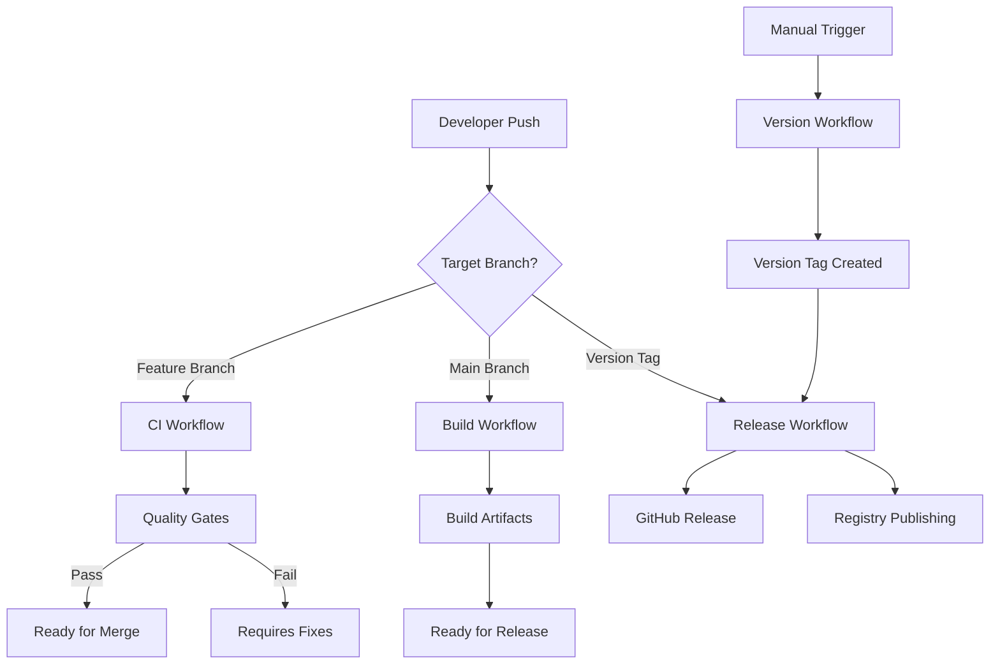

# CI/CD System Documentation

The Personal Pipeline MCP Server uses a comprehensive, unified CI/CD system that coordinates Docker container builds, npm package builds, and automated versioning.

## 🚀 Quick Start

### For Developers

```bash
# Check CI/CD status
npm run cicd:status

# Validate configuration
npm run cicd:validate

# Build all artifacts locally
npm run cicd:build

# Version management
npm run cicd:version:patch
npm run cicd:version:minor
npm run cicd:version:major
```

### For Release Management

```bash
# Manual release workflow trigger
gh workflow run release.yml \
  --field version_bump=minor \
  --field create_release=true \
  --field publish_npm=false

# Manual version bump
npm run cicd:version:minor

# Check release status
gh run list --workflow=release.yml
```

## 🏗️ System Architecture

### Workflow Coordination



### CI/CD Components

| Component | Purpose | Trigger | Output |
|-----------|---------|---------|--------|
| **CI Workflow** | Pull request validation | PR to main | Quality gates, test results |
| **Build Workflow** | Artifact creation | Push to main | npm packages, Docker images |
| **Release Workflow** | Release management | Version tags | GitHub releases, publications |
| **Version Workflow** | Version management | Manual/scheduled | Version bumps, changelogs |

## 📋 Workflow Details

### 1. Continuous Integration (`ci.yml`)

**Purpose:** Comprehensive validation for pull requests

**Quality Gates:**
- ✅ Code formatting (Prettier)
- ✅ Linting (ESLint)
- ✅ TypeScript compilation
- ✅ Test execution with coverage (>80%)
- ✅ Security scanning (npm audit, Trivy, CodeQL)
- ✅ Package build validation
- ✅ Docker build validation
- ✅ Performance benchmarks

**Outputs:**
- Quality gate summary comment on PR
- Test coverage reports
- Security scan results
- Build validation status

### 2. Build & Package (`build.yml`)

**Purpose:** Create production-ready artifacts

**Features:**
- **Intelligent Building:** Only builds what changed
- **Multi-Architecture:** Docker builds for amd64 and arm64
- **Artifact Coordination:** Synchronizes npm and Docker builds
- **Security Scanning:** Comprehensive security validation
- **Quality Validation:** Build and functionality testing

**Outputs:**
- npm package ready for registry
- Multi-architecture Docker images in GHCR
- Build reports and metadata
- Size analysis and performance metrics

### 3. Release Management (`release.yml`)

**Purpose:** Automated release creation and publishing

**Features:**
- **Version Coordination:** Handles both tag-based and manual releases
- **Changelog Generation:** Automated changelog using conventional commits
- **Security Validation:** Pre-release security scanning
- **GitHub Integration:** Creates releases with comprehensive assets
- **Registry Publishing:** Optional publishing to npm and Docker registries

**Release Artifacts:**
- npm package tarball
- Docker images with version tags
- Release notes and changelog
- Security scan reports

### 4. Version Management (`version.yml`)

**Purpose:** Semantic versioning with conventional commits

**Features:**
- **Conventional Commit Analysis:** Automatic version bump detection
- **Semantic Versioning:** Proper major.minor.patch versioning
- **Changelog Generation:** Categorized changelog with emojis
- **Git Integration:** Automatic commit and tag creation
- **Impact Validation:** Build compatibility verification

**Version Strategies:**
- **Auto:** Analyzes commits (feat → minor, fix → patch, BREAKING → major)
- **Manual:** Explicit version bump (patch/minor/major)
- **Custom:** Direct version specification
- **Dry Run:** Preview changes without applying

## 🛠️ Local Development

### CI/CD Coordinator

The `scripts/cicd-coordinator.sh` provides a unified interface:

```bash
# Show comprehensive status
npm run cicd:status
# Output: Project version, branch, CI/CD config, recent runs, artifacts

# Validate configuration
npm run cicd:validate
# Checks: Required files, YAML syntax, script permissions, package.json

# Build management
npm run cicd:build           # Build all artifacts
npm run cicd:build:npm       # Build npm package only
npm run cicd:build:docker    # Build Docker image only

# Version management
npm run cicd:version         # Auto-detect version bump
npm run cicd:version:patch   # Patch version (1.0.0 → 1.0.1)
npm run cicd:version:minor   # Minor version (1.0.0 → 1.1.0)
npm run cicd:version:major   # Major version (1.0.0 → 2.0.0)

# Environment management
npm run cicd:setup           # Setup CI/CD environment
npm run cicd:cleanup         # Cleanup artifacts and temp files
npm run cicd:monitoring      # Show monitoring information
```

### Development Workflow

1. **Feature Development**
   ```bash
   git checkout -b feature/new-feature
   # Make changes
   git commit -m "feat: add new feature"
   git push origin feature/new-feature
   # Create PR → CI workflow validates
   ```

2. **Local Testing**
   ```bash
   npm run cicd:validate    # Check configuration
   npm run cicd:build       # Build locally
   npm test                 # Run tests
   ```

3. **Version Management**
   ```bash
   npm run cicd:version:minor  # Bump version
   git push --follow-tags      # Push with tags
   # Triggers release workflow
   ```

## 🔧 Configuration

### Required Files

```
.github/workflows/
├── ci.yml              # Pull request validation
├── build.yml           # Main branch builds  
├── release.yml         # Release management
└── version.yml         # Version management

scripts/
├── cicd-coordinator.sh # Unified CI/CD interface
├── build-package.sh    # npm package builder
├── version.sh          # Version management
└── test-package.sh     # Package validation

package.json            # npm configuration
Dockerfile             # Docker configuration
tsconfig.json          # TypeScript configuration
```

### Environment Variables

| Variable | Purpose | Required For | Example |
|----------|---------|--------------|---------|
| `GITHUB_TOKEN` | GitHub API access | All workflows | `ghp_xxx` |
| `NPM_TOKEN` | npm publishing | Release workflow | `npm_xxx` |
| `DOCKERHUB_USERNAME` | Docker Hub | Docker publishing | `username` |
| `DOCKERHUB_TOKEN` | Docker Hub token | Docker publishing | `dckr_xxx` |

### Branch Protection

Recommended branch protection for `main`:

```yaml
protection_rules:
  required_status_checks:
    - "Code Quality & Standards"
    - "Test Suite"
    - "Package Build Validation"
    - "Docker Build Validation"
  enforce_admins: false
  required_pull_request_reviews:
    required_approving_review_count: 1
    dismiss_stale_reviews: true
  restrictions: null
```

## 📊 Monitoring & Metrics

### Build Metrics

```bash
# View recent workflow runs
gh run list --limit 10

# View specific workflow
gh run list --workflow=ci.yml

# Download artifacts
gh run download <run-id>

# View logs
gh run view <run-id> --log
```

### Performance Metrics

The CI/CD system tracks:
- **Build Duration:** Time to complete builds
- **Artifact Size:** npm package and Docker image sizes
- **Test Coverage:** Code coverage percentages
- **Security Issues:** Vulnerability counts and severity
- **Success Rates:** Workflow success/failure rates

### Quality Metrics

- **Code Quality:** ESLint errors/warnings
- **Type Safety:** TypeScript compilation issues
- **Test Coverage:** >80% target for unit tests
- **Security:** Zero critical vulnerabilities
- **Performance:** <200ms API response times

## 🛡️ Security

### Security Scanning

- **npm audit:** Dependency vulnerability scanning
- **Trivy:** Container and filesystem security scanning  
- **CodeQL:** Source code security analysis
- **SARIF Integration:** Results uploaded to GitHub Security tab

### Security Policies

- **Critical vulnerabilities** block releases
- **High vulnerabilities** generate warnings
- **Regular security audits** via scheduled workflows
- **Signed commits** recommended for releases
- **Secret scanning** enabled for credentials

### Best Practices

1. **Secrets Management:** Use GitHub secrets, never commit credentials
2. **Dependency Updates:** Regular dependency updates and security patches
3. **Container Security:** Use minimal base images, scan regularly
4. **Access Control:** Limit workflow permissions, use principle of least privilege
5. **Audit Trail:** Maintain comprehensive logs and audit trails

## 🚨 Troubleshooting

### Common Issues

**CI Workflow Failures:**
```bash
# Check specific failure
gh run view <run-id> --log

# Common fixes
npm run lint:fix        # Fix linting issues
npm run format          # Fix formatting
npm test               # Run tests locally
npm run typecheck      # Check TypeScript
```

**Build Failures:**
```bash
# Validate locally
npm run cicd:validate
npm run cicd:build --verbose

# Check dependencies
npm audit
npm ci

# Docker issues
docker build . --no-cache
```

**Release Issues:**
```bash
# Check version format
git tag --list
git describe --tags

# Validate release artifacts
npm run package:validate
docker run --rm <image> npm run health
```

### Debug Commands

```bash
# CI/CD system status
npm run cicd:status

# Detailed validation
npm run cicd:validate --verbose

# Manual build with debug
npm run cicd:build --verbose --dry-run

# Check workflow status
gh run list --json conclusion,displayTitle,createdAt

# Download and inspect artifacts
gh run download --name npm-package-<version>
```

### Getting Help

1. **Check Documentation:** Review workflow files and inline comments
2. **Validate Configuration:** Run `npm run cicd:validate`
3. **Review Logs:** Use `gh run view --log` for detailed failure information
4. **Test Locally:** Use CI/CD coordinator to reproduce issues locally
5. **Check Dependencies:** Ensure all required tools and secrets are configured

## 📈 Performance Optimization

### Build Performance

- **Dependency Caching:** Intelligent npm and Docker layer caching
- **Parallel Execution:** Independent jobs run in parallel
- **Incremental Builds:** Only rebuild what changed
- **Artifact Reuse:** Share artifacts between workflows

### Resource Optimization

- **Matrix Builds:** Parallel multi-architecture builds
- **Conditional Execution:** Skip unnecessary jobs based on changes
- **Efficient Caching:** Optimal cache keys and strategies
- **Resource Limits:** Appropriate timeouts and resource allocation

## 🎯 Best Practices

### Development

1. **Use Conventional Commits:** Enables automatic versioning
2. **Test Locally:** Use CI/CD coordinator before pushing
3. **Small PRs:** Easier to review and validate
4. **Clear Commit Messages:** Helps with changelog generation

### Operations

1. **Monitor Workflows:** Regular review of workflow success rates
2. **Update Dependencies:** Keep GitHub Actions and dependencies current
3. **Security Scanning:** Address security issues promptly
4. **Performance Monitoring:** Track build times and optimization opportunities

### Release Management

1. **Staged Releases:** Test in development before production
2. **Rollback Planning:** Always have rollback procedures ready
3. **Documentation:** Keep changelogs and release notes updated
4. **Communication:** Notify stakeholders of significant releases

---

This CI/CD system provides enterprise-grade automation while maintaining developer productivity and system reliability. For questions or improvements, please refer to the GitHub repository or open an issue.