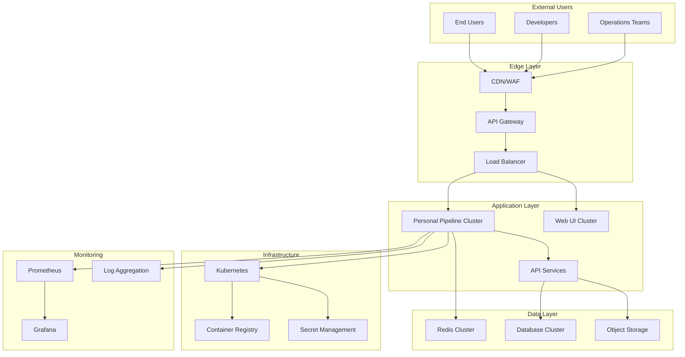

# Personal Pipeline - Enterprise Deployment Guide

Comprehensive guide for large-scale, enterprise-grade deployment of Personal Pipeline including security hardening, compliance, high availability, and operational excellence.

## 📋 Table of Contents

- [Enterprise Architecture Overview](#enterprise-architecture-overview)
- [Security and Compliance](#security-and-compliance)
- [High Availability and Scaling](#high-availability-and-scaling)
- [Monitoring and Observability](#monitoring-and-observability)
- [Backup and Disaster Recovery](#backup-and-disaster-recovery)
- [Performance Optimization](#performance-optimization)
- [Operational Excellence](#operational-excellence)
- [Compliance and Governance](#compliance-and-governance)

## 🏢 Enterprise Architecture Overview

### Reference Architecture



### Enterprise Deployment Patterns

#### Multi-Region Active-Active
```yaml
# Multi-region deployment with active-active pattern
regions:
  us-east-1:
    primary: true
    replicas: 5
    database: primary
    redis: cluster
  
  us-west-2:
    primary: false
    replicas: 3
    database: read-replica
    redis: cluster
  
  eu-west-1:
    primary: false
    replicas: 3
    database: read-replica
    redis: cluster

global_load_balancer:
  provider: cloudflare
  health_checks: true
  failover: automatic
  latency_routing: true
```

#### Hybrid Cloud Deployment
```yaml
# Hybrid deployment across cloud and on-premises
environments:
  cloud_primary:
    provider: aws
    region: us-east-1
    replicas: 5
    data_residency: cloud
  
  on_premises_secondary:
    provider: vmware
    location: datacenter-1
    replicas: 3
    data_residency: on_premises
    
  disaster_recovery:
    provider: azure
    region: east-us
    replicas: 1
    data_residency: cloud
```

## 🔐 Security and Compliance

### Security Architecture

#### Defense in Depth
```yaml
# Security layers configuration
security_layers:
  network:
    - cloud_firewall
    - waf_protection
    - ddos_mitigation
    - vpc_isolation
  
  application:
    - api_authentication
    - rbac_authorization
    - input_validation
    - rate_limiting
  
  data:
    - encryption_at_rest
    - encryption_in_transit
    - key_management
    - data_classification
  
  infrastructure:
    - container_security
    - secrets_management
    - vulnerability_scanning
    - compliance_monitoring
```

#### Authentication and Authorization

##### Enterprise SSO Integration
```yaml
# SAML/OIDC configuration
auth:
  providers:
    - name: "corporate-sso"
      type: "saml2"
      metadata_url: "https://sso.company.com/metadata"
      entity_id: "personal-pipeline"
      attributes:
        email: "http://schemas.xmlsoap.org/ws/2005/05/identity/claims/emailaddress"
        groups: "http://schemas.microsoft.com/ws/2008/06/identity/claims/groups"
    
    - name: "azure-ad"
      type: "oidc"
      issuer: "https://login.microsoftonline.com/tenant-id/v2.0"
      client_id: "${AZURE_CLIENT_ID}"
      client_secret: "${AZURE_CLIENT_SECRET}"

rbac:
  roles:
    admin:
      permissions: ["*"]
      groups: ["PP-Admins"]
    
    operator:
      permissions: ["read", "search", "execute"]
      groups: ["PP-Operators", "Incident-Response"]
    
    viewer:
      permissions: ["read", "search"]
      groups: ["All-Users"]
```

##### Kubernetes RBAC
```yaml
# RBAC configuration for Kubernetes
apiVersion: rbac.authorization.k8s.io/v1
kind: ClusterRole
metadata:
  name: personal-pipeline-operator
rules:
- apiGroups: [""]
  resources: ["pods", "services", "configmaps", "secrets"]
  verbs: ["get", "list", "watch", "create", "update", "patch"]
- apiGroups: ["apps"]
  resources: ["deployments", "replicasets"]
  verbs: ["get", "list", "watch", "create", "update", "patch"]

---
apiVersion: rbac.authorization.k8s.io/v1
kind: ClusterRoleBinding
metadata:
  name: personal-pipeline-operator-binding
roleRef:
  apiGroup: rbac.authorization.k8s.io
  kind: ClusterRole
  name: personal-pipeline-operator
subjects:
- kind: User
  name: personal-pipeline-service-account
  apiGroup: rbac.authorization.k8s.io
```

### Data Protection and Privacy

#### Encryption Configuration
```yaml
# Comprehensive encryption setup
encryption:
  at_rest:
    database:
      provider: "aws-kms"
      key_id: "arn:aws:kms:us-east-1:123456789012:key/12345678-1234-1234-1234-123456789012"
      algorithm: "AES-256-GCM"
    
    object_storage:
      provider: "aws-s3"
      sse_algorithm: "aws:kms"
      kms_key_id: "arn:aws:kms:us-east-1:123456789012:key/87654321-4321-4321-4321-210987654321"
  
  in_transit:
    api:
      tls_version: "1.3"
      cipher_suites: ["TLS_AES_256_GCM_SHA384", "TLS_CHACHA20_POLY1305_SHA256"]
      certificate_provider: "lets_encrypt"
    
    internal:
      mutual_tls: true
      certificate_authority: "internal-ca"

data_classification:
  levels:
    public: {}
    internal:
      encryption_required: true
    confidential:
      encryption_required: true
      access_logging: true
    restricted:
      encryption_required: true
      access_logging: true
      approval_required: true
```

#### Data Retention and Compliance
```yaml
# GDPR/SOC2 compliance configuration
compliance:
  data_retention:
    logs:
      retention_days: 90
      archival_policy: "compress_and_store"
      deletion_policy: "secure_wipe"
    
    user_data:
      retention_days: 2555  # 7 years
      anonymization_days: 30
      deletion_policy: "crypto_shredding"
  
  privacy:
    consent_management: true
    right_to_erasure: true
    data_portability: true
    breach_notification: true
  
  audit:
    access_logging: true
    change_tracking: true
    compliance_monitoring: true
    reporting_schedule: "monthly"
```

### Container Security

#### Secure Container Configuration
```yaml
# Kubernetes security policies
apiVersion: v1
kind: Pod
metadata:
  name: personal-pipeline
spec:
  securityContext:
    runAsNonRoot: true
    runAsUser: 1001
    runAsGroup: 1001
    fsGroup: 1001
    seccompProfile:
      type: RuntimeDefault
  containers:
  - name: personal-pipeline
    image: personal-pipeline/mcp-server:latest
    securityContext:
      allowPrivilegeEscalation: false
      readOnlyRootFilesystem: true
      runAsNonRoot: true
      capabilities:
        drop:
        - ALL
        add:
        - NET_BIND_SERVICE
    resources:
      limits:
        memory: "512Mi"
        cpu: "500m"
      requests:
        memory: "256Mi"
        cpu: "250m"
```

#### Network Policies
```yaml
# Kubernetes network policies
apiVersion: networking.k8s.io/v1
kind: NetworkPolicy
metadata:
  name: personal-pipeline-netpol
spec:
  podSelector:
    matchLabels:
      app: personal-pipeline
  policyTypes:
  - Ingress
  - Egress
  ingress:
  - from:
    - namespaceSelector:
        matchLabels:
          name: ingress-nginx
    ports:
    - protocol: TCP
      port: 3000
  egress:
  - to:
    - namespaceSelector:
        matchLabels:
          name: redis
    ports:
    - protocol: TCP
      port: 6379
  - to: []
    ports:
    - protocol: TCP
      port: 443  # HTTPS outbound
```

## 🏗️ High Availability and Scaling

### Kubernetes Production Deployment

#### Production Deployment Manifest
```yaml
# production-deployment.yaml
apiVersion: apps/v1
kind: Deployment
metadata:
  name: personal-pipeline
  namespace: personal-pipeline
spec:
  replicas: 5
  strategy:
    type: RollingUpdate
    rollingUpdate:
      maxSurge: 2
      maxUnavailable: 1
  selector:
    matchLabels:
      app: personal-pipeline
  template:
    metadata:
      labels:
        app: personal-pipeline
        version: v1
      annotations:
        prometheus.io/scrape: "true"
        prometheus.io/port: "3000"
        prometheus.io/path: "/metrics"
    spec:
      serviceAccountName: personal-pipeline
      affinity:
        podAntiAffinity:
          preferredDuringSchedulingIgnoredDuringExecution:
          - weight: 100
            podAffinityTerm:
              labelSelector:
                matchExpressions:
                - key: app
                  operator: In
                  values:
                  - personal-pipeline
              topologyKey: kubernetes.io/hostname
      containers:
      - name: personal-pipeline
        image: personal-pipeline/mcp-server:0.1.0
        ports:
        - containerPort: 3000
          name: http
        env:
        - name: NODE_ENV
          value: "production"
        - name: REDIS_URL
          valueFrom:
            secretKeyRef:
              name: redis-credentials
              key: url
        - name: LOG_LEVEL
          value: "info"
        resources:
          requests:
            memory: "256Mi"
            cpu: "250m"
          limits:
            memory: "512Mi"
            cpu: "500m"
        livenessProbe:
          httpGet:
            path: /health
            port: 3000
          initialDelaySeconds: 60
          periodSeconds: 30
          timeoutSeconds: 10
          failureThreshold: 3
        readinessProbe:
          httpGet:
            path: /health/ready
            port: 3000
          initialDelaySeconds: 10
          periodSeconds: 10
          timeoutSeconds: 5
          failureThreshold: 3
        volumeMounts:
        - name: config
          mountPath: /app/config
          readOnly: true
        - name: cache
          mountPath: /app/cache
        - name: logs
          mountPath: /app/logs
      volumes:
      - name: config
        configMap:
          name: personal-pipeline-config
      - name: cache
        emptyDir:
          sizeLimit: 1Gi
      - name: logs
        emptyDir:
          sizeLimit: 500Mi

---
apiVersion: v1
kind: Service
metadata:
  name: personal-pipeline-service
  namespace: personal-pipeline
spec:
  selector:
    app: personal-pipeline
  ports:
  - port: 80
    targetPort: 3000
    name: http
  type: ClusterIP

---
apiVersion: autoscaling/v2
kind: HorizontalPodAutoscaler
metadata:
  name: personal-pipeline-hpa
  namespace: personal-pipeline
spec:
  scaleTargetRef:
    apiVersion: apps/v1
    kind: Deployment
    name: personal-pipeline
  minReplicas: 3
  maxReplicas: 20
  metrics:
  - type: Resource
    resource:
      name: cpu
      target:
        type: Utilization
        averageUtilization: 70
  - type: Resource
    resource:
      name: memory
      target:
        type: Utilization
        averageUtilization: 80
  behavior:
    scaleUp:
      stabilizationWindowSeconds: 60
      policies:
      - type: Pods
        value: 2
        periodSeconds: 60
    scaleDown:
      stabilizationWindowSeconds: 300
      policies:
      - type: Pods
        value: 1
        periodSeconds: 60
```

### Database High Availability

#### Redis Cluster Configuration
```yaml
# Redis Cluster for high availability
apiVersion: v1
kind: ConfigMap
metadata:
  name: redis-cluster-config
data:
  redis.conf: |
    cluster-enabled yes
    cluster-config-file nodes.conf
    cluster-node-timeout 5000
    appendonly yes
    appendfsync everysec
    save 900 1
    save 300 10
    save 60 10000
    maxmemory 1gb
    maxmemory-policy allkeys-lru

---
apiVersion: apps/v1
kind: StatefulSet
metadata:
  name: redis-cluster
spec:
  serviceName: redis-cluster
  replicas: 6
  selector:
    matchLabels:
      app: redis-cluster
  template:
    metadata:
      labels:
        app: redis-cluster
    spec:
      containers:
      - name: redis
        image: redis:7-alpine
        ports:
        - containerPort: 6379
        - containerPort: 16379
        command:
        - redis-server
        - /etc/redis/redis.conf
        volumeMounts:
        - name: config
          mountPath: /etc/redis
        - name: data
          mountPath: /data
        resources:
          requests:
            memory: "512Mi"
            cpu: "250m"
          limits:
            memory: "1Gi"
            cpu: "500m"
      volumes:
      - name: config
        configMap:
          name: redis-cluster-config
  volumeClaimTemplates:
  - metadata:
      name: data
    spec:
      accessModes: ["ReadWriteOnce"]
      resources:
        requests:
          storage: 10Gi
```

#### PostgreSQL High Availability
```yaml
# PostgreSQL with streaming replication
apiVersion: postgresql.cnpg.io/v1
kind: Cluster
metadata:
  name: postgres-cluster
spec:
  instances: 3
  
  postgresql:
    parameters:
      max_connections: "200"
      shared_buffers: "256MB"
      effective_cache_size: "1GB"
      checkpoint_completion_target: "0.7"
      wal_buffers: "16MB"
      default_statistics_target: "100"
  
  bootstrap:
    initdb:
      database: personal_pipeline
      owner: pp_user
      secret:
        name: postgres-credentials
  
  storage:
    size: 100Gi
    storageClass: "fast-ssd"
  
  monitoring:
    enabled: true
  
  backup:
    retentionPolicy: "30d"
    barmanObjectStore:
      destinationPath: "s3://backups/postgres"
      s3Credentials:
        accessKeyId:
          name: backup-credentials
          key: ACCESS_KEY_ID
        secretAccessKey:
          name: backup-credentials
          key: SECRET_ACCESS_KEY
      wal:
        retention: "5d"
      data:
        retention: "30d"
```

### Load Balancing and Traffic Management

#### Istio Service Mesh
```yaml
# Istio configuration for traffic management
apiVersion: networking.istio.io/v1alpha3
kind: VirtualService
metadata:
  name: personal-pipeline-vs
spec:
  hosts:
  - personal-pipeline.company.com
  gateways:
  - personal-pipeline-gateway
  http:
  - match:
    - uri:
        prefix: /api/v1
    route:
    - destination:
        host: personal-pipeline-service
        port:
          number: 80
      weight: 90
    - destination:
        host: personal-pipeline-canary-service
        port:
          number: 80
      weight: 10
    fault:
      delay:
        percentage:
          value: 0.1
        fixedDelay: 5s
    retries:
      attempts: 3
      perTryTimeout: 30s
    timeout: 60s

---
apiVersion: networking.istio.io/v1alpha3
kind: DestinationRule
metadata:
  name: personal-pipeline-dr
spec:
  host: personal-pipeline-service
  trafficPolicy:
    connectionPool:
      tcp:
        maxConnections: 100
      http:
        http1MaxPendingRequests: 50
        maxRequestsPerConnection: 2
    loadBalancer:
      simple: LEAST_CONN
    circuitBreaker:
      consecutiveErrors: 5
      interval: 30s
      baseEjectionTime: 30s
      maxEjectionPercent: 50
```

#### NGINX Ingress with Advanced Features
```yaml
# NGINX Ingress with rate limiting and caching
apiVersion: networking.k8s.io/v1
kind: Ingress
metadata:
  name: personal-pipeline-ingress
  annotations:
    nginx.ingress.kubernetes.io/rate-limit: "100"
    nginx.ingress.kubernetes.io/rate-limit-window: "1m"
    nginx.ingress.kubernetes.io/proxy-cache-valid: "200 302 10m"
    nginx.ingress.kubernetes.io/proxy-cache-valid: "404 1m"
    nginx.ingress.kubernetes.io/enable-cors: "true"
    nginx.ingress.kubernetes.io/cors-allow-origin: "https://company.com"
    nginx.ingress.kubernetes.io/ssl-redirect: "true"
    nginx.ingress.kubernetes.io/force-ssl-redirect: "true"
    cert-manager.io/cluster-issuer: "letsencrypt-prod"
spec:
  tls:
  - hosts:
    - personal-pipeline.company.com
    secretName: personal-pipeline-tls
  rules:
  - host: personal-pipeline.company.com
    http:
      paths:
      - path: /
        pathType: Prefix
        backend:
          service:
            name: personal-pipeline-service
            port:
              number: 80
```

## 📊 Monitoring and Observability

### Comprehensive Monitoring Stack

#### Prometheus Configuration
```yaml
# Prometheus configuration for Personal Pipeline
global:
  scrape_interval: 15s
  evaluation_interval: 15s

rule_files:
  - "personal-pipeline-rules.yml"

scrape_configs:
  - job_name: 'personal-pipeline'
    kubernetes_sd_configs:
    - role: pod
    relabel_configs:
    - source_labels: [__meta_kubernetes_pod_annotation_prometheus_io_scrape]
      action: keep
      regex: true
    - source_labels: [__meta_kubernetes_pod_annotation_prometheus_io_path]
      action: replace
      target_label: __metrics_path__
      regex: (.+)
    - source_labels: [__address__, __meta_kubernetes_pod_annotation_prometheus_io_port]
      action: replace
      regex: ([^:]+)(?::\d+)?;(\d+)
      replacement: $1:$2
      target_label: __address__

alerting:
  alertmanagers:
  - kubernetes_sd_configs:
    - role: pod
    relabel_configs:
    - source_labels: [__meta_kubernetes_pod_label_app]
      action: keep
      regex: alertmanager
```

#### Alert Rules
```yaml
# personal-pipeline-rules.yml
groups:
- name: personal-pipeline.rules
  rules:
  - alert: PersonalPipelineDown
    expr: up{job="personal-pipeline"} == 0
    for: 1m
    labels:
      severity: critical
    annotations:
      summary: "Personal Pipeline instance is down"
      description: "Personal Pipeline instance {{ $labels.instance }} has been down for more than 1 minute."

  - alert: PersonalPipelineHighLatency
    expr: histogram_quantile(0.95, rate(http_request_duration_seconds_bucket{job="personal-pipeline"}[5m])) > 1
    for: 5m
    labels:
      severity: warning
    annotations:
      summary: "High latency on Personal Pipeline"
      description: "95th percentile latency is {{ $value }}s for {{ $labels.instance }}"

  - alert: PersonalPipelineHighErrorRate
    expr: rate(http_requests_total{job="personal-pipeline",status=~"5.."}[5m]) / rate(http_requests_total{job="personal-pipeline"}[5m]) > 0.05
    for: 5m
    labels:
      severity: critical
    annotations:
      summary: "High error rate on Personal Pipeline"
      description: "Error rate is {{ $value | humanizePercentage }} for {{ $labels.instance }}"

  - alert: PersonalPipelineLowCacheHitRate
    expr: cache_hits_total / (cache_hits_total + cache_misses_total) < 0.6
    for: 10m
    labels:
      severity: warning
    annotations:
      summary: "Low cache hit rate"
      description: "Cache hit rate is {{ $value | humanizePercentage }} for {{ $labels.instance }}"
```

#### Grafana Dashboards
```json
{
  "dashboard": {
    "id": null,
    "title": "Personal Pipeline - Enterprise Dashboard",
    "tags": ["personal-pipeline", "enterprise"],
    "timezone": "browser",
    "panels": [
      {
        "id": 1,
        "title": "Request Rate",
        "type": "graph",
        "targets": [
          {
            "expr": "sum(rate(http_requests_total{job=\"personal-pipeline\"}[5m])) by (instance)",
            "legendFormat": "{{instance}}"
          }
        ],
        "yAxes": [
          {
            "label": "Requests/sec",
            "min": 0
          }
        ]
      },
      {
        "id": 2,
        "title": "Response Time (95th percentile)",
        "type": "graph",
        "targets": [
          {
            "expr": "histogram_quantile(0.95, sum(rate(http_request_duration_seconds_bucket{job=\"personal-pipeline\"}[5m])) by (le, instance))",
            "legendFormat": "{{instance}}"
          }
        ],
        "yAxes": [
          {
            "label": "Seconds",
            "min": 0
          }
        ]
      },
      {
        "id": 3,
        "title": "Error Rate",
        "type": "graph",
        "targets": [
          {
            "expr": "sum(rate(http_requests_total{job=\"personal-pipeline\",status=~\"5..\"}[5m])) by (instance) / sum(rate(http_requests_total{job=\"personal-pipeline\"}[5m])) by (instance)",
            "legendFormat": "{{instance}}"
          }
        ],
        "yAxes": [
          {
            "label": "Error Rate",
            "min": 0,
            "max": 1
          }
        ]
      },
      {
        "id": 4,
        "title": "Cache Performance",
        "type": "stat",
        "targets": [
          {
            "expr": "cache_hits_total / (cache_hits_total + cache_misses_total) * 100",
            "legendFormat": "Hit Rate %"
          }
        ]
      }
    ],
    "time": {
      "from": "now-1h",
      "to": "now"
    },
    "refresh": "30s"
  }
}
```

### Distributed Tracing

#### Jaeger Configuration
```yaml
# Jaeger for distributed tracing
apiVersion: jaegertracing.io/v1
kind: Jaeger
metadata:
  name: personal-pipeline-jaeger
spec:
  strategy: production
  collector:
    replicas: 3
    resources:
      limits:
        memory: 1Gi
        cpu: 500m
  query:
    replicas: 2
    resources:
      limits:
        memory: 512Mi
        cpu: 250m
  storage:
    type: elasticsearch
    elasticsearch:
      nodeCount: 3
      resources:
        requests:
          memory: 2Gi
          cpu: 1
        limits:
          memory: 4Gi
          cpu: 2
      storage:
        size: 50Gi
```

### Log Aggregation

#### ELK Stack Configuration
```yaml
# Elasticsearch cluster
apiVersion: elasticsearch.k8s.elastic.co/v1
kind: Elasticsearch
metadata:
  name: personal-pipeline-es
spec:
  version: 8.5.0
  nodeSets:
  - name: default
    count: 3
    config:
      node.store.allow_mmap: false
      xpack.security.enabled: true
      xpack.security.transport.ssl.enabled: true
      xpack.security.http.ssl.enabled: true
    podTemplate:
      spec:
        containers:
        - name: elasticsearch
          resources:
            requests:
              memory: 2Gi
              cpu: 1
            limits:
              memory: 4Gi
              cpu: 2
    volumeClaimTemplates:
    - metadata:
        name: elasticsearch-data
      spec:
        accessModes:
        - ReadWriteOnce
        resources:
          requests:
            storage: 100Gi

---
# Kibana
apiVersion: kibana.k8s.elastic.co/v1
kind: Kibana
metadata:
  name: personal-pipeline-kibana
spec:
  version: 8.5.0
  count: 2
  elasticsearchRef:
    name: personal-pipeline-es
  config:
    server.ssl.enabled: true
  podTemplate:
    spec:
      containers:
      - name: kibana
        resources:
          requests:
            memory: 1Gi
            cpu: 500m
          limits:
            memory: 2Gi
            cpu: 1
```

## 💾 Backup and Disaster Recovery

### Backup Strategy

#### Comprehensive Backup Plan
```yaml
# Backup configuration
backup:
  strategy: "3-2-1"  # 3 copies, 2 different media, 1 offsite
  
  application_data:
    frequency: "daily"
    retention: "30d"
    destinations:
      - type: "s3"
        bucket: "pp-backups-primary"
        encryption: true
      - type: "azure-blob"
        container: "pp-backups-secondary"
        encryption: true
  
  database:
    frequency: "hourly"
    retention: "7d"
    point_in_time_recovery: true
    destinations:
      - type: "s3"
        bucket: "pp-db-backups"
        encryption: true
  
  configuration:
    frequency: "on_change"
    retention: "90d"
    versioning: true
    destinations:
      - type: "git"
        repository: "config-backup-repo"
        encryption: true

disaster_recovery:
  rto: "15m"  # Recovery Time Objective
  rpo: "5m"   # Recovery Point Objective
  regions:
    primary: "us-east-1"
    secondary: "us-west-2"
    tertiary: "eu-west-1"
```

#### Automated Backup Scripts
```bash
#!/bin/bash
# enterprise-backup.sh

set -euo pipefail

BACKUP_DATE=$(date +%Y-%m-%d-%H-%M-%S)
BACKUP_ROOT="/backups/personal-pipeline"
RETENTION_DAYS=30

log() {
    echo "[$(date +'%Y-%m-%d %H:%M:%S')] $*"
}

# Create backup directory
mkdir -p "${BACKUP_ROOT}/${BACKUP_DATE}"

log "Starting enterprise backup..."

# Backup Kubernetes resources
log "Backing up Kubernetes resources..."
kubectl get all,configmaps,secrets,ingress,pvc -n personal-pipeline -o yaml > \
    "${BACKUP_ROOT}/${BACKUP_DATE}/k8s-resources.yaml"

# Backup Redis data
log "Backing up Redis cluster..."
for pod in $(kubectl get pods -n personal-pipeline -l app=redis-cluster -o name); do
    kubectl exec -n personal-pipeline $pod -- redis-cli BGSAVE
done

# Wait for background save to complete
sleep 30

# Copy Redis dumps
kubectl cp personal-pipeline/redis-cluster-0:/data/dump.rdb \
    "${BACKUP_ROOT}/${BACKUP_DATE}/redis-dump.rdb"

# Backup PostgreSQL
log "Backing up PostgreSQL..."
kubectl exec -n personal-pipeline postgres-cluster-1 -- \
    pg_dump -U pp_user personal_pipeline | \
    gzip > "${BACKUP_ROOT}/${BACKUP_DATE}/postgres-dump.sql.gz"

# Backup configuration
log "Backing up configuration..."
kubectl get configmaps -n personal-pipeline -o yaml > \
    "${BACKUP_ROOT}/${BACKUP_DATE}/configmaps.yaml"

# Backup certificates and secrets
log "Backing up secrets..."
kubectl get secrets -n personal-pipeline -o yaml > \
    "${BACKUP_ROOT}/${BACKUP_DATE}/secrets.yaml"

# Create archive
log "Creating backup archive..."
tar -czf "${BACKUP_ROOT}/personal-pipeline-backup-${BACKUP_DATE}.tar.gz" \
    -C "${BACKUP_ROOT}" "${BACKUP_DATE}"

# Upload to S3
log "Uploading to S3..."
aws s3 cp "${BACKUP_ROOT}/personal-pipeline-backup-${BACKUP_DATE}.tar.gz" \
    "s3://enterprise-backups/personal-pipeline/"

# Cleanup old backups
log "Cleaning up old backups..."
find "${BACKUP_ROOT}" -name "personal-pipeline-backup-*.tar.gz" \
    -mtime +${RETENTION_DAYS} -delete

log "Backup completed successfully"
```

### Disaster Recovery Procedures

#### Recovery Runbooks
```yaml
# Disaster recovery procedures
recovery_scenarios:
  single_region_failure:
    severity: high
    rto: "15m"
    rpo: "5m"
    procedure:
      - step: "Detect failure via monitoring"
        automation: true
        timeout: "2m"
      
      - step: "Failover DNS to secondary region"
        automation: true
        timeout: "3m"
      
      - step: "Scale up secondary region"
        automation: true
        timeout: "5m"
      
      - step: "Validate service health"
        automation: false
        timeout: "5m"

  database_corruption:
    severity: critical
    rto: "30m"
    rpo: "15m"
    procedure:
      - step: "Stop application writes"
        automation: true
        timeout: "2m"
      
      - step: "Restore from latest backup"
        automation: false
        timeout: "20m"
      
      - step: "Validate data integrity"
        automation: false
        timeout: "5m"
      
      - step: "Resume application"
        automation: false
        timeout: "3m"

  complete_environment_loss:
    severity: critical
    rto: "2h"
    rpo: "1h"
    procedure:
      - step: "Provision new environment"
        automation: false
        timeout: "30m"
      
      - step: "Restore from backups"
        automation: false
        timeout: "60m"
      
      - step: "Update DNS and certificates"
        automation: false
        timeout: "15m"
      
      - step: "Validate full functionality"
        automation: false
        timeout: "15m"
```

## ⚡ Performance Optimization

### Application Performance

#### JVM Tuning (if using Java components)
```yaml
# Java application tuning
java_opts:
  memory:
    heap_size: "2g"
    metaspace_size: "256m"
    direct_memory: "512m"
  
  garbage_collection:
    collector: "G1GC"
    max_gc_pause: "200ms"
    parallel_gc_threads: 4
  
  jit_compilation:
    tier_compilation: true
    compilation_threshold: 10000

# JVM monitoring
monitoring:
  jvm_metrics: true
  gc_logging: true
  flight_recorder: true
  heap_dumps: true
```

#### Node.js Performance Tuning
```yaml
# Node.js optimization
node_opts:
  memory:
    max_old_space: "2048"
    max_new_space: "512"
  
  event_loop:
    max_async_hooks: 10000
    async_hooks_context_frame_size: 200
  
  clustering:
    enabled: true
    workers: "auto"  # CPU count
    respawn: true

# Performance monitoring
performance:
  enable_profiling: true
  cpu_profiling: true
  memory_profiling: true
  event_loop_monitoring: true
```

### Database Optimization

#### Redis Performance Tuning
```redis
# Redis configuration for enterprise performance
maxmemory 4gb
maxmemory-policy allkeys-lru

# Persistence tuning
save 900 1
save 300 10
save 60 10000
appendonly yes
appendfsync everysec
no-appendfsync-on-rewrite no
auto-aof-rewrite-percentage 100
auto-aof-rewrite-min-size 64mb

# Network tuning
tcp-keepalive 300
timeout 0
tcp-backlog 511

# Client tuning
maxclients 10000
```

#### PostgreSQL Performance Tuning
```postgresql
-- PostgreSQL configuration for enterprise workloads
shared_buffers = '1GB'
effective_cache_size = '3GB'
checkpoint_completion_target = 0.7
wal_buffers = '16MB'
default_statistics_target = 100
random_page_cost = 1.1
effective_io_concurrency = 200
work_mem = '4MB'
maintenance_work_mem = '512MB'
min_wal_size = '1GB'
max_wal_size = '4GB'
max_connections = 200

-- Monitoring queries
CREATE EXTENSION IF NOT EXISTS pg_stat_statements;
```

### Infrastructure Optimization

#### Kubernetes Resource Management
```yaml
# Resource quotas and limits
apiVersion: v1
kind: ResourceQuota
metadata:
  name: personal-pipeline-quota
  namespace: personal-pipeline
spec:
  hard:
    requests.cpu: "10"
    requests.memory: 20Gi
    limits.cpu: "20"
    limits.memory: 40Gi
    persistentvolumeclaims: "10"
    pods: "20"

---
apiVersion: v1
kind: LimitRange
metadata:
  name: personal-pipeline-limits
  namespace: personal-pipeline
spec:
  limits:
  - default:
      cpu: "500m"
      memory: "512Mi"
    defaultRequest:
      cpu: "250m"
      memory: "256Mi"
    type: Container
```

## 🔄 Operational Excellence

### GitOps Deployment

#### ArgoCD Configuration
```yaml
# ArgoCD application
apiVersion: argoproj.io/v1alpha1
kind: Application
metadata:
  name: personal-pipeline
  namespace: argocd
spec:
  project: enterprise
  source:
    repoURL: https://github.com/company/personal-pipeline-config.git
    targetRevision: main
    path: overlays/production
  destination:
    server: https://kubernetes.default.svc
    namespace: personal-pipeline
  syncPolicy:
    automated:
      prune: true
      selfHeal: true
    syncOptions:
    - CreateNamespace=true
    retry:
      limit: 3
      backoff:
        duration: 5s
        factor: 2
        maxDuration: 3m
```

### Infrastructure as Code

#### Terraform Configuration
```hcl
# terraform/main.tf
module "eks_cluster" {
  source = "./modules/eks"
  
  cluster_name    = "personal-pipeline-prod"
  cluster_version = "1.24"
  
  vpc_id     = module.vpc.vpc_id
  subnet_ids = module.vpc.private_subnets
  
  node_groups = {
    general = {
      desired_capacity = 3
      max_capacity     = 10
      min_capacity     = 3
      
      instance_types = ["m5.large"]
      
      k8s_labels = {
        Environment = "production"
        Application = "personal-pipeline"
      }
    }
  }
  
  tags = {
    Environment = "production"
    Project     = "personal-pipeline"
    ManagedBy   = "terraform"
  }
}

module "rds_cluster" {
  source = "./modules/rds"
  
  cluster_identifier = "personal-pipeline-db"
  engine            = "aurora-postgresql"
  engine_version    = "13.7"
  
  database_name = "personal_pipeline"
  master_username = "pp_admin"
  
  vpc_id               = module.vpc.vpc_id
  subnet_ids           = module.vpc.database_subnets
  vpc_security_group_ids = [aws_security_group.rds.id]
  
  backup_retention_period = 30
  preferred_backup_window = "03:00-04:00"
  
  tags = {
    Environment = "production"
    Project     = "personal-pipeline"
  }
}
```

### CI/CD Pipeline

#### Enterprise CI/CD with GitLab
```yaml
# .gitlab-ci.yml
stages:
  - security
  - test
  - build
  - deploy-staging
  - security-test
  - deploy-production

variables:
  DOCKER_REGISTRY: registry.company.com
  KUBERNETES_NAMESPACE: personal-pipeline

security-scan:
  stage: security
  image: securecodewarrior/gitlab-sast:latest
  script:
    - sast-scan
  artifacts:
    reports:
      sast: sast-report.json

test:
  stage: test
  image: node:18
  services:
    - redis:7-alpine
    - postgres:14-alpine
  script:
    - npm ci
    - npm run test:unit
    - npm run test:integration
    - npm run test:e2e
  artifacts:
    reports:
      junit: test-results.xml
      coverage: coverage/cobertura-coverage.xml

build:
  stage: build
  image: docker:latest
  services:
    - docker:dind
  script:
    - docker build -t $DOCKER_REGISTRY/personal-pipeline:$CI_COMMIT_SHA .
    - docker push $DOCKER_REGISTRY/personal-pipeline:$CI_COMMIT_SHA

deploy-staging:
  stage: deploy-staging
  image: bitnami/kubectl:latest
  script:
    - kubectl set image deployment/personal-pipeline 
        personal-pipeline=$DOCKER_REGISTRY/personal-pipeline:$CI_COMMIT_SHA
        -n personal-pipeline-staging
    - kubectl rollout status deployment/personal-pipeline -n personal-pipeline-staging

security-test-staging:
  stage: security-test
  image: owasp/zap2docker-stable:latest
  script:
    - zap-baseline.py -t https://staging.personal-pipeline.company.com
  allow_failure: true

deploy-production:
  stage: deploy-production
  image: bitnami/kubectl:latest
  script:
    - kubectl set image deployment/personal-pipeline 
        personal-pipeline=$DOCKER_REGISTRY/personal-pipeline:$CI_COMMIT_SHA
        -n personal-pipeline-production
    - kubectl rollout status deployment/personal-pipeline -n personal-pipeline-production
  when: manual
  only:
    - main
```

## 📋 Compliance and Governance

### Compliance Frameworks

#### SOC 2 Type II Compliance
```yaml
# SOC 2 compliance configuration
compliance:
  soc2:
    security:
      - access_controls: implemented
      - authentication: multi_factor
      - authorization: role_based
      - encryption: end_to_end
      - vulnerability_management: automated
    
    availability:
      - uptime_target: "99.9%"
      - monitoring: comprehensive
      - incident_response: documented
      - disaster_recovery: tested
    
    processing_integrity:
      - data_validation: implemented
      - error_handling: comprehensive
      - logging: complete
      - audit_trails: maintained
    
    confidentiality:
      - data_classification: implemented
      - access_restrictions: enforced
      - encryption_standards: aes_256
      - key_management: hsm_backed
    
    privacy:
      - consent_management: implemented
      - data_retention: automated
      - deletion_procedures: verified
      - breach_notification: automated
```

#### GDPR Compliance
```yaml
# GDPR compliance implementation
gdpr:
  data_protection:
    lawful_basis: "legitimate_interest"
    consent_management: true
    data_minimization: true
    purpose_limitation: true
  
  data_subject_rights:
    right_of_access: implemented
    right_to_rectification: implemented
    right_to_erasure: implemented
    right_to_portability: implemented
    right_to_object: implemented
  
  accountability:
    privacy_impact_assessments: required
    data_protection_officer: appointed
    records_of_processing: maintained
    privacy_by_design: implemented
  
  breach_notification:
    detection_time: "immediate"
    authority_notification: "72_hours"
    data_subject_notification: "immediate"
    documentation: "comprehensive"
```

### Governance Framework

#### Security Governance
```yaml
# Security governance structure
governance:
  security_committee:
    chair: "CISO"
    members: ["CTO", "DevOps Lead", "Compliance Officer"]
    meeting_frequency: "monthly"
    responsibilities:
      - security_policy_approval
      - incident_response_oversight
      - compliance_monitoring
      - risk_assessment_review
  
  change_management:
    approval_process: "multi_stage"
    required_approvers:
      - technical_lead
      - security_team
      - compliance_team
    documentation: "mandatory"
    rollback_plan: "required"
  
  incident_response:
    team_structure: "tiered"
    escalation_matrix: "defined"
    communication_plan: "documented"
    post_incident_review: "mandatory"
```

---

## 📋 Enterprise Deployment Checklist

### Pre-Deployment Planning
- [ ] Security architecture review completed
- [ ] Compliance requirements identified and documented
- [ ] Disaster recovery plan developed and tested
- [ ] Performance requirements defined and validated
- [ ] Monitoring and alerting strategy designed
- [ ] Backup and recovery procedures established

### Infrastructure Setup
- [ ] Multi-region deployment configured
- [ ] High availability architecture implemented
- [ ] Load balancing and traffic management configured
- [ ] Security controls and network policies implemented
- [ ] Monitoring infrastructure deployed
- [ ] Backup systems configured and tested

### Security Implementation
- [ ] Authentication and authorization configured
- [ ] Encryption at rest and in transit implemented
- [ ] Network security controls deployed
- [ ] Vulnerability scanning automated
- [ ] Security monitoring and alerting configured
- [ ] Incident response procedures documented

### Operational Readiness
- [ ] GitOps deployment pipeline configured
- [ ] Infrastructure as code implemented
- [ ] Monitoring dashboards created
- [ ] Alert rules configured and tested
- [ ] Runbooks created and reviewed
- [ ] On-call procedures established

### Compliance and Governance
- [ ] Compliance frameworks implemented
- [ ] Audit logging configured
- [ ] Data retention policies enforced
- [ ] Privacy controls implemented
- [ ] Governance processes documented
- [ ] Regular compliance reviews scheduled

### Performance and Scaling
- [ ] Performance benchmarks established
- [ ] Auto-scaling policies configured
- [ ] Resource limits and quotas set
- [ ] Performance monitoring implemented
- [ ] Capacity planning procedures established
- [ ] Load testing completed

---

**Enterprise deployment of Personal Pipeline requires careful planning, robust architecture, and comprehensive operational procedures. This guide provides the foundation for a secure, scalable, and compliant deployment suitable for large organizations.**

**Next Steps:**
- [Security Hardening Guide](./SECURITY.md)
- [Monitoring and Alerting](./MONITORING.md)
- [Performance Tuning](./PERFORMANCE.md)
- [Compliance Documentation](./COMPLIANCE.md)