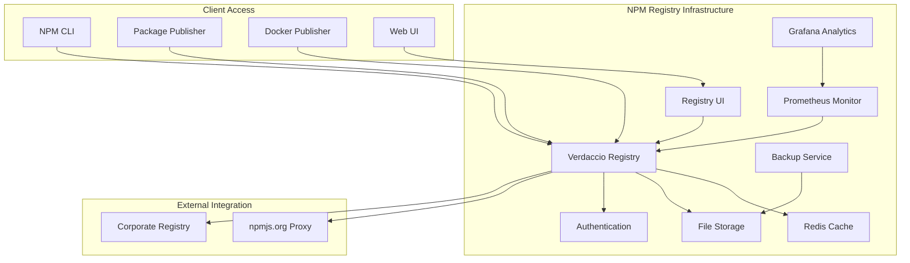

# Private NPM Registry Documentation

**Personal Pipeline - Private NPM Registry Infrastructure**

Authored by: Backend Technical Lead Agent  
Date: 2025-01-16

## Overview

This document provides comprehensive documentation for the Personal Pipeline private NPM registry infrastructure, built with Verdaccio and Docker Compose integration. The registry enables secure internal package distribution, version management, and automated publishing workflows.

## Table of Contents

- [Architecture Overview](#architecture-overview)
- [Quick Start Guide](#quick-start-guide)
- [Installation & Setup](#installation--setup)
- [User Management](#user-management)
- [Package Publishing](#package-publishing)
- [Package Consumption](#package-consumption)
- [Registry Management](#registry-management)
- [Monitoring & Analytics](#monitoring--analytics)
- [Backup & Recovery](#backup--recovery)
- [Security Configuration](#security-configuration)
- [Troubleshooting](#troubleshooting)
- [Best Practices](#best-practices)

## Architecture Overview

### System Architecture



### Core Components

| Component | Purpose | Port | Technology |
|-----------|---------|------|------------|
| **Verdaccio Registry** | Main NPM registry server | 4873 | Node.js/Express |
| **Registry UI** | Web management interface | 8080 | React/Docker |
| **Redis Cache** | Package metadata caching | 6380 | Redis 7.2 |
| **Prometheus Monitor** | Metrics collection | 9091 | Prometheus |
| **Grafana Analytics** | Performance dashboards | 3001 | Grafana |
| **Backup Service** | Automated backup system | - | Alpine Linux |

### Directory Structure

```
registry/npm/
├── config/
│   └── config.yaml           # Verdaccio configuration
├── storage/                  # Package storage
├── logs/                     # Registry logs
├── cache/                    # Local cache data
├── auth/
│   ├── htpasswd             # User authentication
│   └── users.json           # User configuration
├── monitoring/
│   ├── prometheus.yml       # Prometheus config
│   └── npm_registry_rules.yml # Alert rules
├── grafana/
│   ├── dashboards/          # Grafana dashboards
│   └── provisioning/        # Grafana provisioning
├── scripts/
│   ├── backup-npm.sh        # Backup script
│   └── restore-npm.sh       # Restore script
└── backups/                 # Backup storage
```

## Quick Start Guide

### 1. Initial Setup

```bash
# Clone the repository and navigate to the project
cd /path/to/personal-pipeline

# Setup the NPM registry
npm run registry:setup

# Start the registry services
npm run registry:start

# Check registry status
npm run registry:status
```

### 2. User Registration

```bash
# Add a new user (interactive)
npm run registry:adduser

# Or add user via management script
./scripts/registry-manager.sh users add <username>
```

### 3. Package Publishing

```bash
# Build your package
npm run package:build

# Publish to private registry
npm run package:publish

# Verify publication
npm run package:info
```

### 4. Package Consumption

```bash
# Install from private registry
npm install @personal-pipeline/mcp-server --registry http://localhost:4873

# Or set registry in .npmrc
echo "registry=http://localhost:4873/" >> ~/.npmrc
npm install @personal-pipeline/mcp-server
```

## Installation & Setup

### Prerequisites

- **Docker** and **Docker Compose** installed
- **Node.js** 18+ and **npm** 8+
- **Git** for version control
- **htpasswd** utility (or Docker)

### Automated Setup

The easiest way to set up the registry is using the automated setup script:

```bash
# Standard setup
./scripts/setup-npm-registry.sh

# Interactive setup with prompts
./scripts/setup-npm-registry.sh --interactive

# Production setup with enhanced security
./scripts/setup-npm-registry.sh --production

# Clean setup (removes existing data)
./scripts/setup-npm-registry.sh --clean
```

### Manual Setup

If you prefer manual setup:

1. **Create directory structure:**
   ```bash
   mkdir -p registry/npm/{storage,logs,cache,auth,monitoring,grafana,scripts,backups}
   ```

2. **Configure authentication:**
   ```bash
   htpasswd -bc registry/npm/auth/htpasswd admin admin_password_2025
   ```

3. **Start services:**
   ```bash
   docker-compose -f docker-compose.npm-registry.yml up -d
   ```

4. **Verify installation:**
   ```bash
   curl http://localhost:4873/-/ping
   ```

### Configuration Options

#### Verdaccio Configuration

The main configuration is in `registry/npm/config/config.yaml`:

```yaml
# Key configuration options
storage: /verdaccio/storage
auth:
  htpasswd:
    file: /verdaccio/conf/htpasswd
    max_users: 100

packages:
  '@personal-pipeline/*':
    access: '$authenticated'
    publish: '$authenticated'
    unpublish: '$authenticated'
    proxy: npmjs

uplinks:
  npmjs:
    url: https://registry.npmjs.org/
    cache: true
    timeout: 30s
```

#### Environment Variables

Configure the registry using environment variables:

```bash
# Registry settings
VERDACCIO_PUBLIC_URL=http://localhost:4873
VERDACCIO_PORT=4873

# Security settings
VERDACCIO_USER_UID=1001
VERDACCIO_USER_GID=1001

# Performance settings
NODE_OPTIONS="--max-old-space-size=1024"
UV_THREADPOOL_SIZE=16
```

## User Management

### Adding Users

#### Interactive Method
```bash
npm run registry:adduser
```

#### Management Script
```bash
./scripts/registry-manager.sh users add <username>
```

#### Manual Method
```bash
htpasswd -b registry/npm/auth/htpasswd <username> <password>
```

### User Operations

```bash
# List all users
./scripts/registry-manager.sh users list

# Show user information
./scripts/registry-manager.sh users info <username>

# Reset user password
./scripts/registry-manager.sh users reset <username>

# Remove user
./scripts/registry-manager.sh users remove <username>
```

### Authentication

#### Login to Registry
```bash
npm login --registry http://localhost:4873
```

#### Check Current User
```bash
npm whoami --registry http://localhost:4873
```

#### Logout
```bash
npm logout --registry http://localhost:4873
```

## Package Publishing

### Package Preparation

1. **Configure package.json:**
   ```json
   {
     "name": "@personal-pipeline/your-package",
     "version": "1.0.0",
     "publishConfig": {
       "registry": "http://localhost:4873",
       "access": "restricted"
     }
   }
   ```

2. **Build the package:**
   ```bash
   npm run package:build
   ```

### Publishing Methods

#### Automated Publishing (Recommended)
```bash
# Standard publish
npm run package:publish

# Dry run (test without publishing)
npm run package:publish:dry-run

# Beta release
npm run package:publish:beta

# Alpha release
npm run package:publish:alpha
```

#### Manual Publishing
```bash
npm publish --registry http://localhost:4873
```

#### Version Management

```bash
# Patch version (0.0.X)
npm run package:version:patch

# Minor version (0.X.0)
npm run package:version:minor

# Major version (X.0.0)
npm run package:version:major

# Custom version bump
node scripts/version-manager.js <type> [options]
```

### Release Management

#### Complete Release Workflow
```bash
# Prepare release (tests, build, validation)
./scripts/release-manager.sh prepare

# Create release (version bump, tags, changelog)
./scripts/release-manager.sh create --version-type patch

# Publish release
./scripts/release-manager.sh publish

# Show release status
./scripts/release-manager.sh status
```

#### Release Options
```bash
# Interactive release with prompts
./scripts/release-manager.sh create --interactive

# Production release
./scripts/release-manager.sh publish --production

# Rollback to previous version
./scripts/release-manager.sh rollback 1.0.0
```

## Package Consumption

### Installation Methods

#### From Private Registry
```bash
# Direct installation
npm install @personal-pipeline/mcp-server --registry http://localhost:4873

# With specific version
npm install @personal-pipeline/mcp-server@1.0.0 --registry http://localhost:4873
```

#### Using .npmrc Configuration

Create a `.npmrc` file in your project or home directory:

```ini
# Project .npmrc
registry=http://localhost:4873/
@personal-pipeline:registry=http://localhost:4873/
//localhost:4873/:_authToken=<your-auth-token>
always-auth=true
```

#### Global Configuration
```bash
# Set global registry
npm config set registry http://localhost:4873

# Set scoped registry
npm config set @personal-pipeline:registry http://localhost:4873
```

### Package Discovery

#### List Available Packages
```bash
# Using management script
./scripts/registry-manager.sh packages list

# Using npm search
npm search --registry http://localhost:4873

# View registry catalog
curl http://localhost:4873/-/all | jq 'keys'
```

#### Package Information
```bash
# Package details
npm info @personal-pipeline/mcp-server --registry http://localhost:4873

# Package versions
npm info @personal-pipeline/mcp-server versions --registry http://localhost:4873

# Using management script
./scripts/registry-manager.sh packages info @personal-pipeline/mcp-server
```

## Registry Management

### Service Control

```bash
# Start registry
npm run registry:start

# Stop registry
npm run registry:stop

# Restart registry
npm run registry:restart

# Check status
npm run registry:status

# View logs
npm run registry:logs
```

### Health Monitoring

```bash
# Health check
npm run registry:health

# Detailed health status
./scripts/registry-manager.sh health status

# Performance metrics
./scripts/registry-manager.sh health metrics

# Test connectivity
./scripts/registry-manager.sh health test
```

### Package Management

```bash
# List packages
./scripts/registry-manager.sh packages list

# Package information
./scripts/registry-manager.sh packages info <package-name>

# Package versions
./scripts/registry-manager.sh packages versions <package-name>

# Remove package
./scripts/registry-manager.sh packages remove <package-name>
```

### Cleanup Operations

```bash
# Clean old package versions
./scripts/registry-manager.sh cleanup packages

# Clean log files
./scripts/registry-manager.sh cleanup logs

# Clear cache
./scripts/registry-manager.sh cleanup cache

# Complete cleanup
./scripts/registry-manager.sh cleanup all
```

## Monitoring & Analytics

### Web Interfaces

| Interface | URL | Purpose |
|-----------|-----|---------|
| **Registry UI** | http://localhost:8080 | Package browsing and management |
| **Prometheus** | http://localhost:9091 | Metrics and monitoring |
| **Grafana** | http://localhost:3001 | Performance dashboards |

### Grafana Login
- Username: `admin`
- Password: `npm_analytics_2025`

### Analytics Commands

```bash
# Registry statistics
./scripts/registry-manager.sh analytics stats

# Package analytics
./scripts/registry-manager.sh analytics packages

# User analytics
./scripts/registry-manager.sh analytics users

# Performance analytics
./scripts/registry-manager.sh analytics performance
```

### Monitoring Alerts

The system includes pre-configured alerts for:
- Registry downtime
- High memory usage
- Slow response times
- Storage space issues

## Backup & Recovery

### Automated Backups

Backups are created automatically daily at 3 AM and retained for 30 days.

### Manual Backup

```bash
# Create backup
./scripts/registry-manager.sh backup create

# List backups
./scripts/registry-manager.sh backup list

# Backup cleanup
./scripts/registry-manager.sh backup cleanup
```

### Restore Operations

```bash
# Restore from backup
./scripts/registry-manager.sh backup restore <backup-file>

# Example
./scripts/registry-manager.sh backup restore /path/to/npm-registry-backup-20250116_120000.tar.gz
```

### Backup Strategy

- **Daily backups** with 30-day retention
- **Pre-restore backups** created automatically
- **Compressed storage** to save space
- **Integrity verification** before restore

## Security Configuration

### Authentication Security

1. **Strong passwords** enforced for all users
2. **bcrypt hashing** for password storage
3. **JWT tokens** for API authentication
4. **Session management** with configurable timeouts

### Network Security

```yaml
# CORS configuration
http:
  headers:
    "Access-Control-Allow-Origin": "*"
    "Access-Control-Allow-Methods": "GET,PUT,POST,DELETE,OPTIONS"
    "Access-Control-Allow-Headers": "Content-Type,Authorization,Cache-Control"
```

### Package Security

- **Scoped packages** for organization isolation
- **Access control** based on user roles
- **Audit logging** for all package operations
- **Vulnerability scanning** integration ready

### Production Security Checklist

- [ ] Change default passwords
- [ ] Enable HTTPS/TLS
- [ ] Configure firewall rules
- [ ] Set up log rotation
- [ ] Enable audit logging
- [ ] Configure backup encryption
- [ ] Implement access controls
- [ ] Monitor security alerts

## Troubleshooting

### Common Issues

#### Registry Not Accessible

**Problem:** `curl: (7) Failed to connect to localhost port 4873`

**Solutions:**
1. Check if registry is running: `npm run registry:status`
2. Start registry: `npm run registry:start`
3. Check Docker logs: `npm run registry:logs`
4. Verify port availability: `netstat -tulpn | grep 4873`

#### Authentication Failures

**Problem:** `npm ERR! 401 Unauthorized`

**Solutions:**
1. Login to registry: `npm run registry:login`
2. Check authentication token: `npm run registry:whoami`
3. Verify user exists: `./scripts/registry-manager.sh users list`
4. Reset password: `./scripts/registry-manager.sh users reset <username>`

#### Package Not Found

**Problem:** `npm ERR! 404 Not Found`

**Solutions:**
1. Check package exists: `./scripts/registry-manager.sh packages list`
2. Verify registry URL: `npm config get registry`
3. Check package name and version: `npm info <package> --registry http://localhost:4873`

#### Storage Issues

**Problem:** `ENOSPC: no space left on device`

**Solutions:**
1. Check disk space: `df -h`
2. Clean old packages: `./scripts/registry-manager.sh cleanup packages`
3. Clean logs: `./scripts/registry-manager.sh cleanup logs`
4. Clean cache: `./scripts/registry-manager.sh cleanup cache`

### Log Analysis

#### Registry Logs
```bash
# View real-time logs
npm run registry:logs

# Search logs for errors
docker-compose -f docker-compose.npm-registry.yml logs npm-registry | grep ERROR

# Check authentication logs
docker-compose -f docker-compose.npm-registry.yml logs npm-registry | grep auth
```

#### System Logs
```bash
# Container status
docker-compose -f docker-compose.npm-registry.yml ps

# Container stats
docker stats $(docker-compose -f docker-compose.npm-registry.yml ps -q)

# System resources
./scripts/registry-manager.sh health status
```

### Performance Issues

#### Slow Response Times

1. **Check system resources:**
   ```bash
   ./scripts/registry-manager.sh analytics performance
   ```

2. **Clear cache:**
   ```bash
   ./scripts/registry-manager.sh cleanup cache
   ```

3. **Optimize configuration:**
   - Increase memory limits in Docker Compose
   - Tune Redis cache settings
   - Enable package compression

#### High Memory Usage

1. **Monitor memory usage:**
   ```bash
   docker stats --no-stream
   ```

2. **Adjust memory limits:**
   ```yaml
   # In docker-compose.npm-registry.yml
   environment:
     NODE_OPTIONS: "--max-old-space-size=512"
   ```

3. **Clear old data:**
   ```bash
   ./scripts/registry-manager.sh cleanup all
   ```

## Best Practices

### Package Management

1. **Use scoped packages** for organization (`@personal-pipeline/package-name`)
2. **Follow semantic versioning** (major.minor.patch)
3. **Include comprehensive metadata** in package.json
4. **Test packages** before publishing
5. **Document package usage** and APIs

### Security Best Practices

1. **Regular password updates** for registry users
2. **Audit package publications** regularly
3. **Monitor access logs** for suspicious activity
4. **Keep registry software updated**
5. **Use HTTPS** in production environments

### Operational Best Practices

1. **Regular backups** with tested restore procedures
2. **Monitor disk space** and performance metrics
3. **Log rotation** to prevent disk space issues
4. **Document procedures** for team members
5. **Test disaster recovery** scenarios

### Development Workflow

1. **Version management** with automated tools
2. **CI/CD integration** for publishing
3. **Code quality gates** before publishing
4. **Release notes** with changelogs
5. **Rollback procedures** for failed releases

### Performance Optimization

1. **Use caching** effectively (Redis + local cache)
2. **Monitor response times** and set alerts
3. **Optimize package sizes** before publishing
4. **Clean up old versions** regularly
5. **Scale resources** based on usage patterns

## Support and Resources

### Documentation Links

- [Verdaccio Official Documentation](https://verdaccio.org/docs/what-is-verdaccio)
- [NPM CLI Documentation](https://docs.npmjs.com/cli/v9)
- [Docker Compose Reference](https://docs.docker.com/compose/)

### Internal Resources

- Configuration files: `registry/npm/config/`
- Management scripts: `scripts/`
- Monitoring dashboards: http://localhost:3001
- Registry UI: http://localhost:8080

### Getting Help

1. **Check logs** for error messages
2. **Review documentation** for common issues
3. **Use management scripts** for diagnostics
4. **Monitor system resources** and performance
5. **Contact team** for complex issues

---

**Last Updated:** 2025-01-16  
**Version:** 1.0.0  
**Maintainer:** Backend Technical Lead Agent