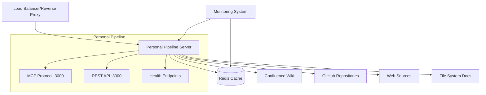

# Personal Pipeline - Production Deployment Guide

## Overview

This guide provides step-by-step instructions for deploying Personal Pipeline (PP) to production environments. The system is designed for high availability, security, and performance in production settings.

## Prerequisites

### System Requirements
- **Operating System**: Linux (Ubuntu 20.04+, CentOS 8+, RHEL 8+) or macOS
- **Node.js**: >= 18.0.0 (LTS recommended)
- **npm**: >= 8.0.0
- **Memory**: Minimum 2GB RAM, Recommended 4GB+ for production
- **Storage**: Minimum 10GB, Recommended 50GB+ for document indexing
- **Network**: HTTPS capable, ports 3000 (or custom) accessible

### External Services
- **Redis**: >= 6.0.0 (Required for production - persistent caching)
- **Documentation Sources**: Access credentials for Confluence, GitHub, etc.
- **Monitoring**: Prometheus/Grafana (optional but recommended)

## Production Architecture Overview



## Step-by-Step Deployment

### Step 1: Environment Setup

#### 1.1 Create Deployment User
```bash
# Create dedicated user for the application
sudo useradd -m -s /bin/bash pp-service
sudo mkdir -p /opt/personal-pipeline
sudo chown pp-service:pp-service /opt/personal-pipeline
```

#### 1.2 Install Node.js (if not present)
```bash
# Ubuntu/Debian
curl -fsSL https://deb.nodesource.com/setup_18.x | sudo -E bash -
sudo apt-get install -y nodejs

# CentOS/RHEL
curl -fsSL https://rpm.nodesource.com/setup_18.x | sudo bash -
sudo yum install -y nodejs

# Verify installation
node --version  # Should be >= 18.0.0
npm --version   # Should be >= 8.0.0
```

### Step 2: Redis Installation and Configuration

#### 2.1 Install Redis
```bash
# Ubuntu/Debian
sudo apt update
sudo apt install redis-server

# CentOS/RHEL
sudo yum install epel-release
sudo yum install redis

# macOS (if deploying locally)
brew install redis
```

#### 2.2 Configure Redis for Production
```bash
# Edit Redis configuration
sudo nano /etc/redis/redis.conf

# Key production settings:
# bind 127.0.0.1 ::1          # Bind to localhost only (security)
# requirepass your_strong_password_here  # Set password
# maxmemory 1gb               # Set memory limit
# maxmemory-policy allkeys-lru # Memory eviction policy
# save 900 1                  # Save snapshots
# save 300 10
# save 60 10000
```

#### 2.3 Start and Enable Redis
```bash
# Start Redis service
sudo systemctl start redis-server
sudo systemctl enable redis-server

# Verify Redis is running
redis-cli ping  # Should return PONG
```

### Step 3: Application Deployment

#### 3.1 Clone and Setup Application
```bash
# Switch to deployment user
sudo su - pp-service

# Clone the repository
cd /opt/personal-pipeline
git clone <your-repo-url> .

# Install dependencies
npm ci --production

# Build the application
npm run build
```

#### 3.2 Create Production Configuration

Create `/opt/personal-pipeline/config/production.yaml`:

```yaml
# Production Configuration for Personal Pipeline
server:
  port: 3000
  host: "0.0.0.0"
  environment: "production"

# Logging configuration
logging:
  level: "info"
  format: "json"
  file: "/var/log/personal-pipeline/app.log"

# Cache configuration (Redis required for production)
cache:
  redis:
    enabled: true
    host: "localhost"
    port: 6379
    password: "${REDIS_PASSWORD}"
    db: 0
    ttl: 3600
    max_memory_policy: "allkeys-lru"
  
  memory:
    enabled: true
    max_items: 1000
    ttl: 1800

# Performance settings
performance:
  max_concurrent_requests: 100
  request_timeout: 30000
  enable_compression: true
  cache_warming: true

# Security settings
security:
  cors:
    enabled: true
    origins: ["https://your-domain.com"]
  rate_limiting:
    enabled: true
    requests_per_minute: 60
  input_validation:
    enabled: true
    max_request_size: "10mb"

# Documentation sources
sources:
  - name: "production-confluence"
    type: "confluence"
    base_url: "${CONFLUENCE_URL}"
    auth:
      type: "bearer_token"
      token_env: "CONFLUENCE_TOKEN"
    space_keys: ["OPS", "RUNBOOKS"]
    refresh_interval: "1h"
    priority: 1

  - name: "ops-github"
    type: "github"
    owner: "your-org"
    repo: "ops-docs"
    auth:
      token_env: "GITHUB_TOKEN"
    paths: ["runbooks/", "procedures/"]
    refresh_interval: "30m"
    priority: 2

  - name: "local-docs"
    type: "filesystem"
    path: "/opt/personal-pipeline/docs/production"
    watch_changes: true
    refresh_interval: "5m"
    priority: 3

# Health monitoring
monitoring:
  enabled: true
  metrics_port: 9090
  health_check_interval: 30
  performance_tracking: true
```

### Step 4: Environment Variables

#### 4.1 Create Environment File
```bash
# Create secure environment file
sudo nano /opt/personal-pipeline/.env.production

# Add the following (replace with actual values):
NODE_ENV=production
CONFIG_FILE=/opt/personal-pipeline/config/production.yaml

# Redis credentials
REDIS_PASSWORD=your_strong_redis_password

# Source credentials
CONFLUENCE_URL=https://your-org.atlassian.net/wiki
CONFLUENCE_TOKEN=your_confluence_api_token
GITHUB_TOKEN=your_github_personal_access_token

# Security
JWT_SECRET=your_jwt_secret_key
API_KEY=your_api_key_for_external_access

# Monitoring (optional)
PROMETHEUS_ENABLED=true
GRAFANA_URL=https://your-grafana-instance.com
```

#### 4.2 Secure Environment File
```bash
# Set proper permissions
chmod 600 /opt/personal-pipeline/.env.production
chown pp-service:pp-service /opt/personal-pipeline/.env.production
```

### Step 5: System Service Configuration

#### 5.1 Create Systemd Service File
```bash
sudo nano /etc/systemd/system/personal-pipeline.service
```

Add the following content:

```ini
[Unit]
Description=Personal Pipeline MCP Server
Documentation=https://github.com/your-org/personal-pipeline
After=network.target redis.service
Wants=redis.service

[Service]
Type=simple
User=pp-service
Group=pp-service
WorkingDirectory=/opt/personal-pipeline
Environment=NODE_ENV=production
EnvironmentFile=/opt/personal-pipeline/.env.production
ExecStart=/usr/bin/node dist/index.js
ExecReload=/bin/kill -HUP $MAINPID
Restart=always
RestartSec=10
StandardOutput=journal
StandardError=journal
SyslogIdentifier=personal-pipeline

# Security settings
NoNewPrivileges=true
PrivateTmp=true
ProtectSystem=strict
ProtectHome=true
ReadWritePaths=/opt/personal-pipeline /var/log/personal-pipeline

# Resource limits
LimitNOFILE=65536
LimitNPROC=4096

[Install]
WantedBy=multi-user.target
```

#### 5.2 Create Log Directory
```bash
sudo mkdir -p /var/log/personal-pipeline
sudo chown pp-service:pp-service /var/log/personal-pipeline
sudo chmod 755 /var/log/personal-pipeline
```

#### 5.3 Enable and Start Service
```bash
# Reload systemd configuration
sudo systemctl daemon-reload

# Enable service to start on boot
sudo systemctl enable personal-pipeline

# Start the service
sudo systemctl start personal-pipeline

# Check service status
sudo systemctl status personal-pipeline
```

### Step 6: Reverse Proxy Setup (Nginx)

#### 6.1 Install Nginx
```bash
# Ubuntu/Debian
sudo apt install nginx

# CentOS/RHEL
sudo yum install nginx
```

#### 6.2 Configure Nginx Proxy
```bash
sudo nano /etc/nginx/sites-available/personal-pipeline
```

Add the following configuration:

```nginx
# Personal Pipeline Nginx Configuration
upstream personal_pipeline {
    server 127.0.0.1:3000;
    keepalive 64;
}

server {
    listen 80;
    server_name your-domain.com;
    return 301 https://$server_name$request_uri;
}

server {
    listen 443 ssl http2;
    server_name your-domain.com;

    # SSL Configuration
    ssl_certificate /path/to/your/certificate.crt;
    ssl_certificate_key /path/to/your/private.key;
    ssl_protocols TLSv1.2 TLSv1.3;
    ssl_ciphers ECDHE-RSA-AES256-GCM-SHA512:DHE-RSA-AES256-GCM-SHA512:ECDHE-RSA-AES256-GCM-SHA384:DHE-RSA-AES256-GCM-SHA384;
    ssl_prefer_server_ciphers off;

    # Security headers
    add_header X-Frame-Options DENY;
    add_header X-Content-Type-Options nosniff;
    add_header X-XSS-Protection "1; mode=block";
    add_header Strict-Transport-Security "max-age=63072000; includeSubDomains; preload";

    # Logging
    access_log /var/log/nginx/personal-pipeline.access.log;
    error_log /var/log/nginx/personal-pipeline.error.log;

    # Rate limiting
    limit_req_zone $binary_remote_addr zone=api:10m rate=10r/s;
    
    location / {
        limit_req zone=api burst=20 nodelay;
        
        proxy_pass http://personal_pipeline;
        proxy_http_version 1.1;
        proxy_set_header Upgrade $http_upgrade;
        proxy_set_header Connection 'upgrade';
        proxy_set_header Host $host;
        proxy_set_header X-Real-IP $remote_addr;
        proxy_set_header X-Forwarded-For $proxy_add_x_forwarded_for;
        proxy_set_header X-Forwarded-Proto $scheme;
        proxy_cache_bypass $http_upgrade;
        
        # Timeouts
        proxy_connect_timeout 60s;
        proxy_send_timeout 60s;
        proxy_read_timeout 60s;
    }
    
    # Health check endpoint (no rate limiting)
    location /api/health {
        proxy_pass http://personal_pipeline;
        proxy_http_version 1.1;
        proxy_set_header Host $host;
        proxy_set_header X-Real-IP $remote_addr;
        proxy_set_header X-Forwarded-For $proxy_add_x_forwarded_for;
        proxy_set_header X-Forwarded-Proto $scheme;
    }
}
```

#### 6.3 Enable Nginx Configuration
```bash
# Enable site
sudo ln -s /etc/nginx/sites-available/personal-pipeline /etc/nginx/sites-enabled/

# Test configuration
sudo nginx -t

# Start and enable Nginx
sudo systemctl start nginx
sudo systemctl enable nginx
```

### Step 7: SSL Certificate Setup

#### 7.1 Using Let's Encrypt (Recommended)
```bash
# Install certbot
sudo apt install certbot python3-certbot-nginx

# Obtain certificate
sudo certbot --nginx -d your-domain.com

# Test automatic renewal
sudo certbot renew --dry-run
```

### Step 8: Initial System Validation

#### 8.1 Health Check
```bash
# Check application health
curl -f http://localhost:3000/api/health

# Should return JSON with status information
```

#### 8.2 Performance Validation
```bash
# Run basic performance test
cd /opt/personal-pipeline
npm run benchmark:quick

# Check logs for any issues
sudo journalctl -u personal-pipeline -f
```

#### 8.3 Documentation Indexing
```bash
# Run initial documentation indexing
cd /opt/personal-pipeline
sudo -u pp-service npm run generate-sample-data

# Check indexing results
curl -X POST http://localhost:3000/api/search \
  -H "Content-Type: application/json" \
  -d '{"query": "test", "limit": 5}'
```

## Production Monitoring

### Health Monitoring Endpoints
- `GET /api/health` - Basic health status
- `GET /api/performance` - Performance metrics
- `GET /api/sources` - Source adapter health

### Log Monitoring
```bash
# Application logs
sudo journalctl -u personal-pipeline -f

# Nginx access logs
sudo tail -f /var/log/nginx/personal-pipeline.access.log

# Redis logs
sudo journalctl -u redis-server -f
```

### Performance Monitoring
```bash
# Real-time performance dashboard
npm run health:dashboard

# System resource monitoring
htop
iotop
```

## Backup and Recovery

### Configuration Backup
```bash
# Backup configuration files
tar -czf personal-pipeline-config-$(date +%Y%m%d).tar.gz \
  /opt/personal-pipeline/config/ \
  /opt/personal-pipeline/.env.production \
  /etc/systemd/system/personal-pipeline.service \
  /etc/nginx/sites-available/personal-pipeline
```

### Redis Data Backup
```bash
# Redis automatic backups (configured in redis.conf)
# Manual backup
redis-cli BGSAVE

# Copy backup file
cp /var/lib/redis/dump.rdb /backup/location/dump-$(date +%Y%m%d).rdb
```

### Application Code Backup
```bash
# Version control is primary backup
# For production state backup:
tar -czf personal-pipeline-app-$(date +%Y%m%d).tar.gz \
  /opt/personal-pipeline --exclude=node_modules --exclude=.git
```

## Maintenance Procedures

### Updates and Patches
```bash
# 1. Create backup (see above)
# 2. Stop service
sudo systemctl stop personal-pipeline

# 3. Pull latest code
cd /opt/personal-pipeline
git pull origin main

# 4. Update dependencies
npm ci --production

# 5. Build application  
npm run build

# 6. Start service
sudo systemctl start personal-pipeline

# 7. Verify deployment
curl -f http://localhost:3000/api/health
```

### Log Rotation
```bash
# Configure logrotate for application logs
sudo nano /etc/logrotate.d/personal-pipeline
```

Add:
```
/var/log/personal-pipeline/*.log {
    daily
    missingok
    rotate 30
    compress
    delaycompress
    notifempty
    create 644 pp-service pp-service
    postrotate
        systemctl reload personal-pipeline
    endscript
}
```

## Security Considerations

### Firewall Configuration
```bash
# Allow SSH (if remote management needed)
sudo ufw allow ssh

# Allow HTTP/HTTPS
sudo ufw allow 80/tcp
sudo ufw allow 443/tcp

# Deny direct application access (proxied through Nginx)
sudo ufw deny 3000/tcp

# Enable firewall
sudo ufw enable
```

### Security Hardening
1. **Keep system updated**: `sudo apt update && sudo apt upgrade`
2. **Disable unnecessary services**: `sudo systemctl list-unit-files --enabled`
3. **Monitor access logs**: Regular review of Nginx and application logs
4. **Use strong credentials**: Rotate API keys and passwords regularly
5. **Enable fail2ban**: `sudo apt install fail2ban`

### Credential Management
- Store all secrets in environment variables
- Use dedicated service accounts for external APIs
- Rotate credentials quarterly
- Monitor for credential leaks in logs

## Troubleshooting

### Common Issues

#### Service Won't Start
```bash
# Check service status
sudo systemctl status personal-pipeline

# Check logs
sudo journalctl -u personal-pipeline -n 50

# Common causes:
# - Redis not running: sudo systemctl start redis-server  
# - Permission issues: chown pp-service:pp-service /opt/personal-pipeline
# - Port conflicts: netstat -tlnp | grep :3000
```

#### Poor Performance
```bash
# Check resource usage
htop
df -h
free -m

# Check Redis memory usage
redis-cli info memory

# Run performance diagnostics
npm run benchmark
```

#### Connection Issues
```bash
# Test internal connectivity
curl -v http://localhost:3000/api/health

# Test external connectivity
curl -v https://your-domain.com/api/health

# Check Nginx status
sudo systemctl status nginx
sudo nginx -t
```

### Getting Help
- Check application logs: `sudo journalctl -u personal-pipeline`
- Review configuration: Validate YAML syntax and environment variables
- Test components: Use health endpoints and benchmarking tools
- Monitor resources: Check CPU, memory, and disk usage

## Performance Tuning

### Node.js Optimization
```bash
# Set Node.js production flags
export NODE_ENV=production
export NODE_OPTIONS="--max-old-space-size=4096"
```

### Redis Optimization
- Configure appropriate `maxmemory` setting
- Use `allkeys-lru` eviction policy
- Enable persistence with appropriate `save` intervals
- Monitor memory usage with `redis-cli info memory`

### Nginx Optimization
- Enable gzip compression
- Configure appropriate worker processes
- Tune connection limits and timeouts
- Enable HTTP/2 support

This completes the production deployment guide. The system is now ready for enterprise-scale operations with high availability, security, and performance.