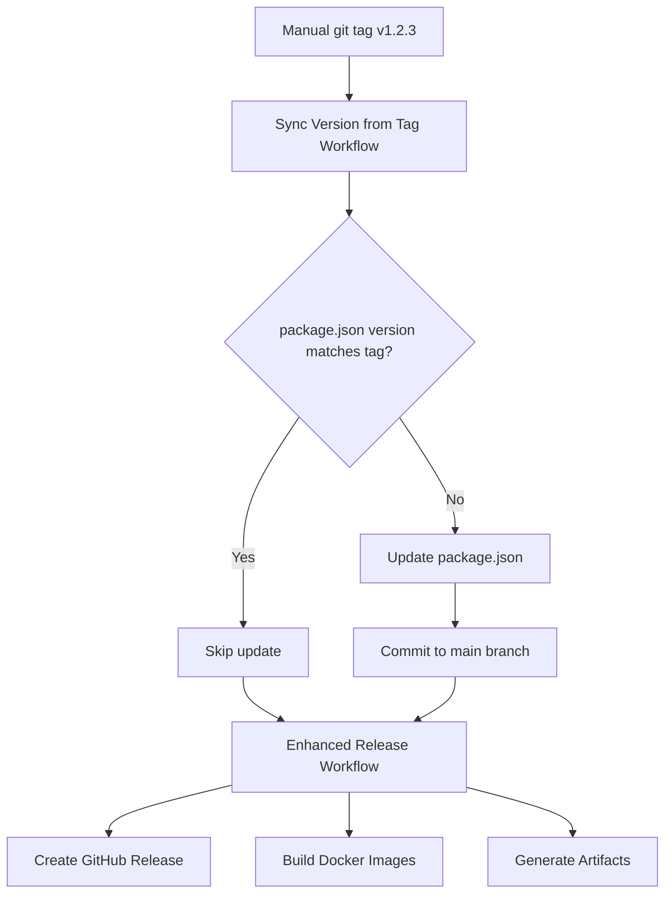

# Version Tagging Guide

This document explains how to use the automated version tagging system for Personal Pipeline.

## 🎯 Quick Usage

### Manual Tagging (Recommended for Releases)

```bash
# Create and push a new version tag
git tag v1.2.3
git push --tags
```

**What happens automatically:**
1. ✅ **Version Sync Workflow** updates `package.json` to match the tag
2. ✅ **Enhanced Release Workflow** creates GitHub release with artifacts
3. ✅ Docker images are built and tagged appropriately

### Automated Version Management

```bash
# Use GitHub Actions interface:
# Go to Actions → Version Management → Run workflow
# Select bump type: patch/minor/major/auto
```

## 🔄 Workflow Sequence

### When You Create a Manual Tag:



### Current Workflows:

1. **Sync Version from Tag** (`sync-version-from-tag.yml`)
   - **Triggers**: When tags matching `v*` are pushed
   - **Purpose**: Ensures package.json version matches git tag
   - **Actions**: Updates package.json if needed, commits to main

2. **Enhanced Release** (`enhanced-release.yml`) 
   - **Triggers**: After version sync completes OR manual dispatch
   - **Purpose**: Creates professional releases with full artifacts
   - **Actions**: GitHub release, Docker images, validation

3. **Version Management** (`version.yml`)
   - **Triggers**: Manual dispatch or main branch pushes
   - **Purpose**: Automated semantic versioning with conventional commits
   - **Actions**: Analyzes commits, bumps version, creates tag

## 📋 Version States

### Current Version Status:
- **Package.json**: `0.3.5`
- **Latest Git Tag**: `v0.3.5`
- **Status**: ✅ In Sync

### After Manual Tagging:
```bash
git tag v0.4.0 && git push --tags
```

**Before Sync Workflow:**
- Package.json: `0.3.5`
- Git Tag: `v0.4.0`  
- Status: ❌ Out of Sync

**After Sync Workflow:**
- Package.json: `0.4.0` (automatically updated)
- Git Tag: `v0.4.0`
- Status: ✅ In Sync

## 🛠️ Advanced Usage

### Semantic Version Examples:

```bash
# Patch release (0.3.5 → 0.3.6)
git tag v0.3.6

# Minor release (0.3.5 → 0.4.0)  
git tag v0.4.0

# Major release (0.3.5 → 1.0.0)
git tag v1.0.0

# Pre-release (0.3.5 → 0.4.0-rc.1)
git tag v0.4.0-rc.1
```

### Manual Release Control:

```bash
# Create tag but trigger release manually
git tag v1.2.3
git push --tags
# Then: GitHub Actions → Enhanced Release → Run workflow
```

### Version Management Workflow:

**Manual Dispatch Options:**
- `bump_type`: patch, minor, major, prerelease, auto
- `commit_and_tag`: Create commit and tag (default: true)
- `dry_run`: Show changes without applying (default: false)
- `custom_version`: Override bump_type with specific version

## ⚡ Troubleshooting

### If Version Sync Fails:
```bash
# Check workflow status in GitHub Actions
# Manual sync if needed:
npm version --no-git-tag-version 1.2.3
git add package.json
git commit -m "chore: sync version with tag v1.2.3"
git push origin main
```

### If Enhanced Release Fails:
- Check that version sync completed successfully
- Verify all tests pass in main branch
- Re-run Enhanced Release workflow manually

### Version Mismatch Detection:
The sync workflow automatically detects and fixes mismatches between:
- Git tag version (e.g., `v1.2.3`)  
- Package.json version (e.g., `1.2.3`)

## 🎛️ Configuration

### Workflow Permissions:
All version workflows have `contents: write` permission to:
- Update package.json
- Create commits and tags
- Push changes to main branch

### Branch Protection:
Version sync commits bypass branch protection using:
- GitHub Actions token
- Automated commit messages with Claude Code signature

## 📚 Related Documentation

- [CI/CD Guide](CICD.md) - Complete CI/CD pipeline documentation
- [Release Management](RELEASE-MANAGEMENT.md) - Professional release processes  
- [GitHub Actions Workflows](.github/workflows/) - All workflow configurations