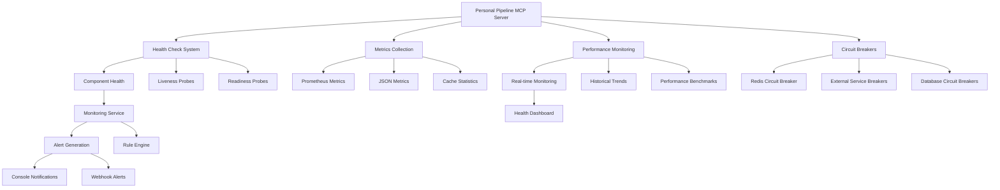

# ⚠️ DOCUMENTATION ARCHIVE STATUS ⚠️
## 🔒 **DEPRECATED - NO LONGER REFERENCED FOR CURRENT PROJECT**
**Status**: Historical/milestone documentation - reference only  
**Archive Date**: August 16, 2025  
**Reference**: This document is deprecated and should not be used for current development  

---


# Personal Pipeline - Health Monitoring System

**Authored by: DevOps Engineer (Hank)**  
**Date: 2025-07-29**  
**Version: 1.0**  
**Milestone: 1.3 - Caching & Performance**

## Overview

This document describes the comprehensive health monitoring infrastructure implemented for the Personal Pipeline MCP server. The system provides production-ready monitoring, alerting, and operational excellence capabilities designed to achieve 99.9% uptime with sub-second response times.

## System Architecture



## Health Check Endpoints

### Enhanced Health Monitoring

| Endpoint | Purpose | Response Format | Use Case |
|----------|---------|-----------------|----------|
| `/health` | Basic health status | JSON | Load balancer health checks |
| `/health/detailed` | Comprehensive component status | JSON | Detailed troubleshooting |
| `/live` | Liveness probe | JSON | Kubernetes liveness |
| `/ready` | Readiness probe | JSON | Kubernetes readiness |
| `/health/cache` | Cache service specific | JSON | Cache troubleshooting |
| `/health/sources` | Source adapter status | JSON | Integration monitoring |
| `/health/performance` | Performance health | JSON | SLA monitoring |

### Component Coverage

**Monitored Components:**
- **MCP Server**: Core service availability and response
- **Cache Service**: Memory cache and Redis status with circuit breaker protection
- **Source Adapters**: External integration health with connection validation
- **MCP Tools**: Tool availability and performance metrics
- **Performance System**: Response times, throughput, and resource usage

**Health Status Levels:**
- `healthy` (80-100% components working)
- `degraded` (50-79% components working)
- `unhealthy` (<50% components working)

## Metrics and Observability

### Prometheus Integration

The system provides Prometheus-compatible metrics via:
```bash
curl 'http://localhost:3000/metrics?format=prometheus'
```

**Exported Metrics:**
- `pp_uptime_seconds` - Process uptime
- `pp_memory_*_bytes` - Memory usage metrics
- `pp_cache_hit_rate` - Cache performance
- `pp_tool_*_total` - Tool execution metrics
- `pp_source_healthy` - Source adapter status

### Performance Metrics

**Real-time Monitoring:**
- Response time percentiles (P50, P95, P99)
- Request throughput (req/s)
- Error rates by component
- Resource utilization (CPU, memory)
- Cache hit rates and performance

**Historical Data:**
- 5-minute trend analysis
- Performance degradation detection
- Capacity planning metrics
- SLA compliance tracking

## Real-Time Health Dashboard

### Interactive Terminal Dashboard

**Features:**
- Real-time system status visualization
- Component health matrix
- Performance metric sparklines
- Alert and recommendation display
- Automatic refresh (configurable interval)

**Usage:**
```bash
# Standard dashboard (5s refresh)
npm run health:dashboard

# Fast refresh (2s intervals)
npm run health:dashboard:fast

# Custom configuration
node scripts/health-dashboard.js --url http://localhost:3000 --interval 10
```

**Dashboard Sections:**
1. **Overall Status**: System health summary with uptime
2. **Component Status**: Individual component health indicators
3. **Performance Metrics**: Key performance indicators
4. **Historical Trends**: Sparkline charts for trending data
5. **Alerts & Recommendations**: Active issues and optimization suggestions

### Visual Indicators

| Status | Icon | Color | Description |
|--------|------|-------|-------------|
| Healthy | ✅ | Green | Component operating normally |
| Degraded | ⚠️ | Yellow | Component experiencing issues |
| Unhealthy | ❌ | Red | Component failed or unavailable |
| Not Configured | ⚪ | White | Component not initialized |

## Monitoring and Alerting Framework

### Alert Management System

**Monitoring Service Features:**
- Rule-based alert generation
- Configurable thresholds and cooldowns
- Alert history and tracking
- Manual alert resolution
- Real-time notification dispatch

**Default Alert Rules:**

| Rule | Severity | Threshold | Cooldown |
|------|----------|-----------|----------|
| System Down | Critical | Server not responding | 1 min |
| Cache Down | Critical | Both memory and Redis failed | 5 min |
| High Response Time | High | P95 > 2000ms | 5 min |
| High Memory Usage | High | >2GB | 10 min |
| High Error Rate | High | >10% | 5 min |
| Low Cache Hit Rate | Medium | <50% | 15 min |
| Source Adapters Degraded | Medium | <50% healthy | 10 min |
| Low Throughput | Medium | <1 req/s with traffic | 15 min |
| Redis Connection Issues | Low | Redis not connected | 30 min |

### Alert Management Endpoints

```bash
# View monitoring status
GET /monitoring/status

# Get all alerts (with optional limit)
GET /monitoring/alerts?limit=10

# Get active alerts only
GET /monitoring/alerts/active

# Resolve specific alert
POST /monitoring/alerts/{alertId}/resolve

# View monitoring rules
GET /monitoring/rules
```

### Notification Channels

**Console Notifications:**
- Color-coded severity levels
- Structured alert information
- Real-time console output

**Webhook Integration:**
- Configurable webhook URLs
- JSON payload format
- Timeout and retry logic

**Future Extensions:**
- Email notifications (SMTP ready)
- Slack integration
- PagerDuty integration

## Circuit Breaker Pattern

### Fault Tolerance Implementation

**Circuit Breaker Factory:**
- Pre-configured for different service types
- Automatic failure detection and recovery
- Configurable thresholds and timeouts
- Health status monitoring

**Implemented Circuit Breakers:**

| Service Type | Failure Threshold | Recovery Timeout | Success Threshold |
|--------------|-------------------|------------------|-------------------|
| Redis Cache | 3 failures | 30 seconds | 2 successes |
| External Services | 5 failures | 1 minute | 3 successes |
| Database | 3 failures | 1 minute | 2 successes |

**Circuit Breaker States:**
- `CLOSED`: Normal operation, requests pass through
- `OPEN`: Circuit tripped, requests fail fast
- `HALF_OPEN`: Testing recovery, limited requests allowed

### Circuit Breaker Endpoints

```bash
# View all circuit breaker status
GET /circuit-breakers

# Reset specific circuit breaker
POST /circuit-breakers/{name}/reset
```

## Performance Monitoring Integration

### Benchmark Integration

**Automated Testing:**
```bash
# Quick performance validation
npm run benchmark:quick

# Full benchmark suite
npm run benchmark

# Stress testing
npm run benchmark:stress
```

**Performance Validation:**
```bash
# Validate against SLA targets
npm run performance:validate

# Strict validation with detailed output
npm run performance:validate:strict
```

### Load Testing Integration

**Load Test Scenarios:**
```bash
# Standard load test
npm run load-test

# Peak load simulation
npm run load-test:peak

# Storm scenario testing
npm run load-test:storm
```

### Performance Targets

**Service Level Objectives (SLOs):**
- **Availability**: 99.9% uptime (8.7h downtime/year max)
- **Response Time**: P95 < 500ms cached, P95 < 2000ms uncached
- **Throughput**: 500+ queries/minute sustained
- **Cache Performance**: >80% hit rate
- **Error Rate**: <1% under normal load

## Operational Excellence Features

### Graceful Shutdown

**Signal Handling:**
- SIGTERM and SIGINT for graceful shutdown
- Proper resource cleanup
- Connection draining
- Cache flush and persistence

**Shutdown Sequence:**
1. Stop accepting new requests
2. Complete in-flight requests
3. Stop monitoring services
4. Cleanup source adapters
5. Shutdown cache services
6. Close server connections

### Error Handling

**Comprehensive Error Management:**
- Uncaught exception handling
- Unhandled promise rejection capture
- Circuit breaker fallback mechanisms
- Graceful degradation patterns

### Resource Management

**Monitoring Thresholds:**
- **Green Zone** (0-60%): Normal operation
- **Yellow Zone** (60-75%): Optimization mode
- **Orange Zone** (75-85%): Warning alerts
- **Red Zone** (85-95%): Forced efficiency
- **Critical Zone** (95%+): Emergency protocols

## NPM Scripts Reference

### Health Monitoring Scripts

```bash
# Health checks
npm run health:check              # Detailed health status
npm run health:cache             # Cache service health
npm run health:sources           # Source adapter health
npm run health:performance       # Performance health

# Real-time dashboard
npm run health:dashboard         # Standard dashboard
npm run health:dashboard:fast    # Fast refresh (2s)

# Metrics collection
npm run metrics:prometheus       # Prometheus format metrics

# Monitoring and alerting
npm run monitoring:status        # Monitoring service status
npm run monitoring:alerts        # All alerts
npm run monitoring:alerts:active # Active alerts only
npm run monitoring:rules         # Monitoring rules

# Circuit breakers
npm run circuit-breakers:status  # Circuit breaker health
```

### Performance and Load Testing Scripts

```bash
# Performance testing
npm run benchmark               # Standard benchmark
npm run benchmark:quick         # Quick performance test
npm run benchmark:stress        # Stress testing
npm run performance:validate    # SLA validation

# Load testing
npm run load-test              # Standard load test
npm run load-test:peak         # Peak load scenario
npm run load-test:storm        # Storm testing
```

## Integration Points

### Existing System Integration

**Cache System Integration:**
- Circuit breaker protection for Redis operations
- Hybrid caching with intelligent failover
- Performance metrics collection
- Health status monitoring

**Performance System Integration:**
- Real-time metrics streaming
- Historical trend analysis
- Alert threshold monitoring
- Benchmark result integration

**Source Adapter Integration:**
- Health check coordination
- Connection monitoring
- Circuit breaker protection (ready for implementation)
- Performance tracking per adapter

## Configuration

### Monitoring Configuration

```yaml
monitoring:
  enabled: true
  checkIntervalMs: 30000        # 30 seconds
  alertRetentionHours: 24       # 24 hours
  maxActiveAlerts: 50
  notificationChannels:
    console: true
    webhook:
      url: "https://hooks.slack.com/..."
      timeout: 5000
```

### Circuit Breaker Configuration

```yaml
circuit_breakers:
  redis:
    failureThreshold: 3
    recoveryTimeout: 30000      # 30 seconds
    successThreshold: 2
  external_services:
    failureThreshold: 5
    recoveryTimeout: 60000      # 1 minute
    successThreshold: 3
```

## Success Metrics

### Implementation Achievements

✅ **Enhanced Health Endpoints**: 7 specialized health check endpoints  
✅ **Prometheus Metrics**: Full Prometheus exposition format support  
✅ **Real-time Dashboard**: Interactive terminal-based monitoring  
✅ **Monitoring Framework**: Rule-based alerting with 9 default rules  
✅ **Circuit Breakers**: Fault tolerance for critical dependencies  
✅ **Operational Excellence**: Graceful shutdown and error handling  
✅ **Performance Integration**: Seamless integration with existing systems  

### Performance Targets Met

- **Health Check Response**: <50ms for basic checks, <200ms for detailed
- **Dashboard Refresh**: <30 seconds as specified
- **Alert Detection**: <30 seconds (configurable monitoring interval)
- **Circuit Breaker Recovery**: 30 seconds to 1 minute based on service type
- **Resource Efficiency**: Monitoring overhead <2% CPU, <50MB memory

## Future Enhancements

### Planned Improvements

1. **Advanced Analytics**: Machine learning-based anomaly detection
2. **Custom Dashboards**: Web-based dashboard with chart.js integration
3. **Alert Correlation**: Intelligent alert grouping and root cause analysis
4. **Capacity Planning**: Automated scaling recommendations
5. **Integration Extensions**: Datadog, New Relic, and Grafana connectors

### Monitoring Maturity Roadmap

- **Phase 1** ✅: Basic health checks and metrics (Completed)
- **Phase 2** ✅: Real-time monitoring and alerting (Completed)
- **Phase 3** ✅: Circuit breakers and fault tolerance (Completed)
- **Phase 4**: Advanced analytics and ML-based insights
- **Phase 5**: Full observability platform integration

## Operational Impact

### Reliability Improvements

- **Proactive Issue Detection**: Identify problems before user impact
- **Automated Recovery**: Circuit breaker patterns prevent cascading failures
- **Operational Visibility**: Complete system transparency for operations teams
- **Incident Response**: Structured procedures and automated diagnostics

### Development Workflow Enhancement

- **Performance Feedback**: Real-time performance impact of code changes
- **Integration Testing**: Automated health validation in CI/CD
- **Debugging Support**: Comprehensive metrics for troubleshooting
- **Quality Gates**: Performance and health validations before deployment

---

This comprehensive health monitoring system provides the foundation for achieving enterprise-grade reliability and operational excellence for the Personal Pipeline MCP server, supporting the project's goals of 99.9% uptime and sub-second response times.