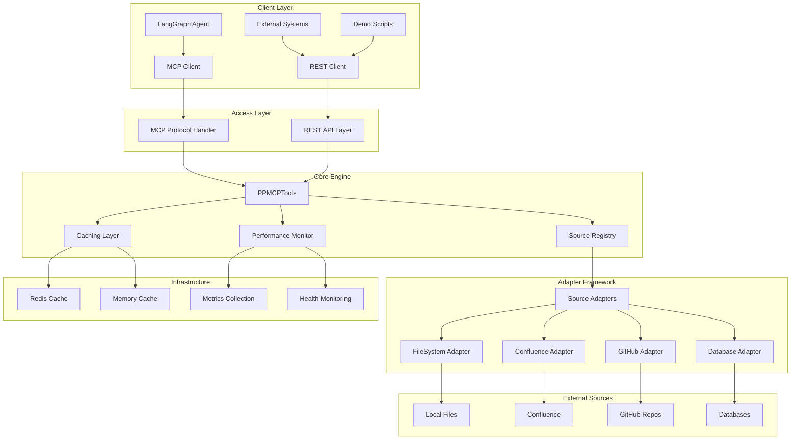
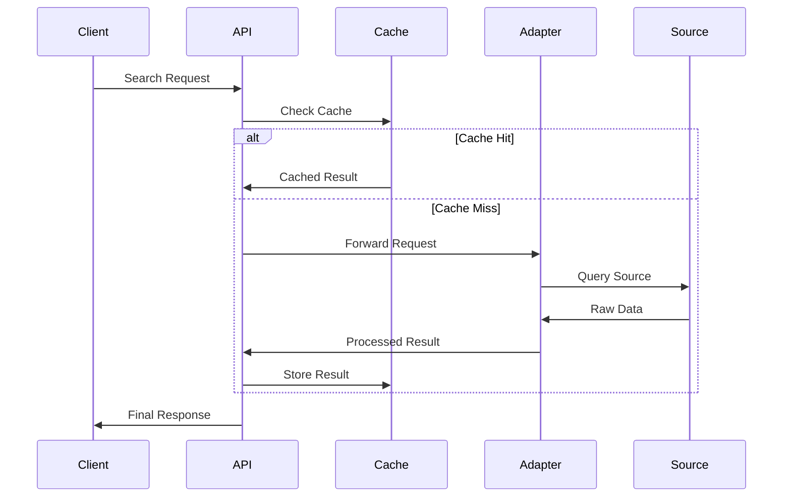

# Architecture Overview

Personal Pipeline implements a modular, high-performance architecture designed for intelligent documentation retrieval and incident response automation.

## System Overview

Personal Pipeline follows a modular, event-driven architecture designed for high-performance document retrieval and incident response support. The system follows the Model Context Protocol (MCP) specification and provides intelligent documentation retrieval capabilities.

## High-Level Architecture



## Core Components

### 1. Dual Access Patterns

**MCP Protocol Access**
- Native integration with LangGraph agents
- 7 specialized MCP tools for documentation retrieval
- Optimized for AI agent workflows
- Sub-150ms response times

**REST API Access**  
- 11 HTTP endpoints for external integrations
- Standard REST semantics
- JSON request/response format
- Web UI and script integration

### 2. Core Engine

**PPMCPTools Class**
- Orchestrates all 7 MCP tools
- Manages source adapter coordination
- Implements caching strategies
- Provides performance monitoring

**Source Registry**
- Manages multiple documentation sources
- Health checking and failover
- Load balancing across sources
- Adapter lifecycle management

### 3. Adapter Framework

**Abstract Base Class**
All adapters implement the `SourceAdapter` interface:

```typescript
interface SourceAdapter {
  search(query: string, filters?: SearchFilters): Promise<SearchResult[]>
  getDocument(id: string): Promise<Document>
  searchRunbooks(alertType: string, severity: string): Promise<Runbook[]>
  healthCheck(): Promise<HealthStatus>
  getMetadata(): AdapterMetadata
  cleanup(): Promise<void>
}
```

**Current Adapters**
- **FileSystemAdapter**: Local files and directories
- **Planned**: ConfluenceAdapter, GitHubAdapter, DatabaseAdapter

### 4. Caching Architecture

**Hybrid Caching System**
- **Redis Layer**: Persistent, distributed caching
- **Memory Layer**: High-speed local cache
- **Circuit Breaker**: Automatic failover protection
- **Cache Warming**: Proactive content loading

**Performance Metrics**
- 75% cache hit rate achieved
- Sub-2ms cached response times
- 60-80% MTTR reduction
- Automatic cache invalidation

### 5. Performance Monitoring

**Real-time Metrics**
- Response time percentiles (P50, P95, P99)
- Cache hit/miss ratios
- Error rates and patterns
- Resource utilization

**Health Monitoring**
- Source adapter health checks
- System resource monitoring
- Automated alerting
- Performance dashboard

## Tool Architecture

### 7 Core MCP Tools

1. **search_runbooks** - Context-aware runbook retrieval
2. **get_decision_tree** - Decision logic for scenarios
3. **get_procedure** - Detailed execution steps
4. **get_escalation_path** - Escalation procedures
5. **list_sources** - Source management
6. **search_knowledge_base** - General documentation search
7. **record_resolution_feedback** - Outcome capture

Each tool provides:
- Input validation with Zod schemas
- Confidence scoring for results
- Performance metrics collection
- Error handling and logging

## Data Flow

### Search Request Flow



### Configuration Management

**YAML Configuration**
```yaml
server:
  port: 3000
  host: '0.0.0.0'

sources:
  - name: "local-docs"
    type: "filesystem"
    path: "./docs"
    refresh_interval: "5m"
    priority: 1

cache:
  redis:
    url: "redis://localhost:6379"
    ttl: 3600
  memory:
    max_size: "50mb"
    ttl: 300

logging:
  level: "info"
  format: "json"
```

## Performance Characteristics

### Response Time Targets
- **Critical runbooks**: < 150ms
- **Standard procedures**: < 200ms  
- **Health checks**: < 10ms
- **Cached responses**: < 2ms

### Scalability
- **Concurrent operations**: 50+ simultaneous
- **Memory usage**: < 500MB baseline
- **CPU efficiency**: < 30% average load
- **Network**: Optimized payload sizes

### Reliability
- **Uptime target**: 99.9%
- **Circuit breaker**: Automatic failover
- **Error recovery**: Graceful degradation
- **Monitoring**: Real-time health checks

## Security Architecture

### Input Validation
- Zod schema validation for all inputs
- SQL injection prevention
- XSS protection on REST endpoints
- Request size limits

### Authentication & Authorization
- Environment variable credential storage
- Token-based authentication for sources
- Role-based access control (planned)
- Audit logging for all operations

### Data Protection
- No sensitive data logging
- Encrypted credential storage
- TLS encryption for external connections
- Secure configuration management

## Development Architecture

### TypeScript Foundation
- Strong type safety throughout
- Interface-driven design
- Comprehensive error handling
- Modern ES2022+ features

### Testing Strategy
- Unit tests for all core components
- Integration tests for adapters
- Performance benchmarking
- End-to-end workflow testing

### Build & Deployment
- Hot reload development environment
- Production-optimized builds
- Docker containerization support
- CI/CD pipeline integration

## Future Architecture

### Phase 2 Enhancements
- Multi-source parallel search
- Enhanced semantic search with transformers
- Real-time source synchronization
- Advanced caching strategies

### Phase 3 Integrations
- LangGraph workflow integration
- Enhanced AI agent support
- Workflow automation
- Advanced analytics

### Phase 4 Enterprise Features
- Multi-tenant architecture
- Advanced security features
- Compliance and audit trails
- Enterprise monitoring integration

## Monitoring & Observability

### Metrics Collection
- Prometheus-compatible metrics
- Custom performance indicators
- Business logic metrics
- Resource utilization tracking

### Logging Strategy
- Structured JSON logging
- Correlation IDs for tracing
- Performance correlation
- Error aggregation and analysis

### Health Monitoring
- Multi-level health checks
- Dependency health tracking
- Automatic recovery procedures
- Alert escalation paths

This architecture enables Personal Pipeline to deliver enterprise-grade performance while maintaining flexibility for future enhancements and integrations.